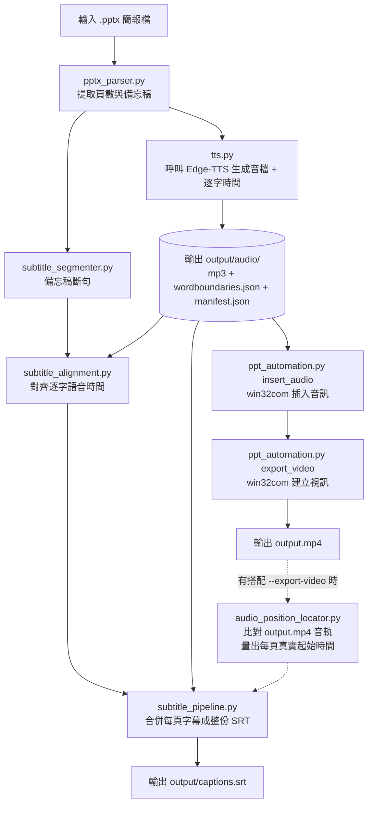

# 專案交接報告

## 專案名稱
pptx2video (PPTX Auto Presenter)

## 文件版本
對應程式版本 v0.5.0；本文件已改寫，移除與 README.md / CHANGELOG.md / TODO.md 重複的內容，只保留架構設計、設計原因、PowerPoint COM 特性、開發注意事項、維護建議與未來擴充方向。v0.5.0 更新：字幕生成從 PoC 畢業，第 4.4 節與第 7 節對應項目已改寫。

## 目標對象
接手開發者、AI 協作 Agent

## 撰寫日期
2026-07-31

---

## 快速導覽

這份文件不重複記錄「現在有哪些功能、CLI 怎麼用」這類內容，那些請見：

- 功能特色、CLI 使用方式、快速開始：[README.md](README.md)
- 版本歷史：[CHANGELOG.md](CHANGELOG.md)
- 待辦事項與已知限制：[TODO.md](TODO.md)

這份文件專注在「為什麼這樣設計、開發時要注意什麼、之後接手要往哪裡擴充」。

---

## 1. 專案願景與目標

pptx2video 是一套針對 Windows 桌面環境設計的輕量化自動化工具，目標是將 PowerPoint 簡報檔（.pptx）轉換為具備語音配音、動畫保留與精確字幕的 MP4 影片。

### 核心價值
- 減少人工逐張錄音與排練時間
- 保留 PowerPoint 原生動畫、轉場與字型樣式
- 避免使用 ASR/Whisper 造成字幕錯字與斷句不準
- 讓非技術使用者也能快速產出可發佈的簡報影片

---

## 2. 設計方向與技術選型

本專案採用「資料流管線」與「PowerPoint 原生自動化」架構：

1. 解析 .pptx 的頁數與備忘稿
2. 使用 Edge-TTS 產生逐頁語音，同時取得逐字時間（WordBoundary）
3. 透過 Windows COM 控制 PowerPoint 插入音訊並匯出 MP4
4. 把備忘稿斷句、對齊到逐字語音時間，合併成整份 SRT 字幕——沒有搭配匯出影片時用「預測」時間軸（每頁時長加總）；有搭配 `--export-video` 時，改在匯出完成後，用音訊互相關比對匯出影片的實際音軌，取代預測（見第 4.10 節、CHANGELOG v0.6.0）

### 主要技術選型與原因

| 選型 | 原因 |
|---|---|
| TTS：`edge-tts` | 免費、免 API Key、語音自然；`boundary="WordBoundary"`（7.2.0+）額外提供逐字時間，是字幕對齊的資料來源 |
| PPT 自動化：`pywin32` / `win32com` | 可保留原生動畫與轉場，這是選擇 PowerPoint COM 而非其他影片合成方案（例如純粹用 ffmpeg 疊圖）的核心原因 |
| PPT 內容解析：`python-pptx` | 可直接讀取投影片與備忘稿，不需要另外解析 XML |
| 字幕斷句：`jieba` 中文斷詞 + 顯示寬度規則，而非 ASR/Whisper | 備忘稿文字本身就是逐字稿，不需要承擔語音辨識的辨識錯誤風險；斷句只需要決定「在哪裡換行」，`jieba` 用來避免從中文詞語中間硬切 |
| 字幕時間：對齊 edge-tts 實際回報的 WordBoundary 時間，而非時間累加估算 | 早期版本（`subtitle_generator.py`，已移除）用音檔總長度平均分配時間，只是估算；`subtitle_alignment.py` 改用實際語音時間，精確度高很多，見第 4.5 節 |
| 字幕合併時間軸：搭配 `--export-video` 時改用真實起始時間，而非預測 | 在一份真實長講稿測試（2 小時 40 分、20 頁）中發現，單純把每頁 mp3 時長加總的預測時間軸，會跟 PowerPoint 實際匯出的影片累積漂移到數秒，而且不是單純等比例關係、無法用一個縮放係數校正（見 `scripts/verify_slide_timing.py` 的實測數據與 CHANGELOG v0.6.0）。改用 `numpy`/`scipy` 的 FFT 互相關，直接在匯出好的 MP4 音軌裡量出每頁語音的真實位置，見第 4.10 節 |

整體 Pipeline 的模組串接圖（哪個模組輸出餵給哪個模組）：



`F3` 合併字幕時間軸有兩種模式：只有 `--subtitles-output`（沒有匯出影片）時用「預測」（把每頁 mp3 時長加總）；有搭配 `--export-video` 時，字幕改到匯出完成後才產生，改用 `audio_position_locator.py` 量到的**真實**起始時間，取代預測（見 CHANGELOG v0.6.0，長影片下預測會逐頁累積漂移）。細節見第 4.6、4.7 節。

圖中沒畫出來的錯誤處理路徑（`_fail()` 統一收斂、單頁跳過 vs 整體中止）見第 4.9 節、第 4.8 節的例外階層、與第 5.6 節的 Skip/Abort 判斷表；COM session 的開關生命週期見第 3 節與第 4.3 節。

---

## 3. PowerPoint COM 特性（重要，之後維護務必先讀）

這節記錄的是「花了實測才確認、但不查文件完全猜不到」的 PowerPoint COM 行為，是這個專案最容易踩坑的地方。

### `PlayOnEntry` 旗標

`shape.AnimationSettings.PlaySettings.PlayOnEntry` 這個舊版 API，雖然在 PowerPoint 編輯 UI 上完全看不出任何效果（Start 設定依然顯示「按一下時」），但**拿掉這個設定會讓 PowerPoint「建立視訊」匯出的 MP4 完全沒有聲音、且每頁變回固定 5 秒**，設定它之後匯出就正確無誤。目前程式碼（`ppt_automation.py: insert_audio`）固定會設定這個旗標，但底層原理尚未查證清楚——如果之後 PowerPoint 版本更新導致行為改變，這裡需要重新測試這個結論是否仍然成立。

### `CreateVideoStatus` 列舉值

`export_video()` 用來判斷匯出是否完成的 `CreateVideoStatus` 狀態值（none/in_progress/queued/done/failed），是依照 Microsoft 官方文件的 `PpMediaTaskStatus` 列舉假設，**並未逐一比對過所有 PowerPoint 版本**。目前已加上安全網：即使 API 回報「完成」，程式還是會額外檢查輸出檔案是否真的存在且非空，來降低誤判風險。如果之後在不同 PowerPoint 版本上遇到匯出邏輯誤判（例如卡住不進行、或誤報完成），這裡是優先排查的地方。

### 轉場時間不需要額外處理

原本規劃過「設定投影片自動播放與切換時間」，後來確認不需要——PowerPoint 的「建立視訊」匯出功能在沒有手動錄製時間的情況下，本來就會自動依嵌入媒體（也就是插入的音訊）的時長決定該頁停留多久，不需要額外邏輯去計算或設定。

### 現場放映模式仍需點擊音符圖示

透過 COM 的 `AddMediaObject2` 插入媒體時，音訊的 Start 設定固定顯示「按一下時」，跟手動用 UI 插入不同；曾嘗試透過 `slide.TimeLine.MainSequence` 修改動畫觸發方式，但在實測環境中不穩定（找不到對應效果）。**已確認這件事不影響 MP4 匯出**，只影響「投影片放映」現場播放模式，因此目前刻意不處理，優先確保匯出正確無誤。若之後有現場放映（非匯出影片）的需求，需要再回來解決。

### v0.4.1 修的兩個問題背後的原因

v0.4.1 修正的 `insert_audio()` 逾時保護與 `--tts-max-retries` 負值防呆，技術細節與程式碼變更請見 [CHANGELOG.md](CHANGELOG.md) 的對應條目。這裡只補充一個設計取捨：`insert_audio()` 的逾時是用背景執行緒 + `future.result(timeout=...)` 包住整段流程，而不是對個別 COM 呼叫個別加 timeout——因為 COM 呼叫本身沒有原生的逾時參數，唯一能做的是「限制等待這整段同步流程的總時間」，逾時後也**無法強制關閉卡住的 PowerPoint**，只能讓呼叫端不再繼續等待。這跟下面 5.5 節「COM 操作為何不做自動重試」是同一個風險考量的兩種展現方式。

---

## 4. 每個模組的責任範圍

### 4.1 pptx_parser.py

**Input**：`.pptx` 檔案路徑
**Output**：結構化的 slides 資料（頁碼、標題、備忘稿文字）
**主要依賴**：`python-pptx`

負責：
- 解析 .pptx
- 取得投影片數量
- 取得每頁備忘稿文字
- 處理空白頁或無 notes 的情況
- 解析失敗時拋出 `PptParseError`

### 4.2 tts.py

**Input**：每頁備忘稿文字
**Output**：MP3 音檔（依頁碼命名）、`manifest.json`、`slide_XXX.wordboundaries.json`（逐字時間資料）
**主要依賴**：`edge-tts`

負責：
- 將文本轉為語音檔
- 使用 edge-tts 逐頁生成音檔
- 生成失敗時拋出 `TTSGenerationError`，訊息會標明是第幾頁失敗，並保留原始例外鏈
- 僅對判斷為暫時性的網路/服務錯誤重試（見 `_is_retryable`），`max_retries` 若傳負值會被 clamp 成 0，確保重試迴圈至少執行一次，不會出現「從未呼叫生成、卻仍記錄成功」的情況（v0.4.1 修正）
- `synthesize_with_word_boundaries()`：透過 edge-tts streaming API 額外取得每個語音片段的文字與時間（`offset_seconds`/`duration_seconds`）。`generate_audio_files()` 預設（沒有自訂 `generator` 時）就是用這個當底層實作，同一次 TTS 呼叫順便把結果存成 `slide_XXX.wordboundaries.json` 旁路檔案，並記錄進 `manifest.json` 的 `word_boundaries_file` 欄位（v0.5.0 新增）——自訂 `generator` 不保證支援這個介面，此時 `word_boundaries_file` 固定是 `None`，字幕生成會跳過該投影片並記錄警告，不是硬性錯誤
- `find_suspected_dropped_narration()`（見 4.5 節 `subtitle_alignment.py`）疑似漏講偵測：每頁生成完後，`generate_audio_files()` 會（僅限預設 generator）自動呼叫這個函式比對這一頁的 WordBoundary 覆蓋情形，結果存進 `manifest.json` 每筆 entry 的 `narration_gap_warnings` 欄位，並透過新增的 `on_narration_gap(slide_num, suspect)` callback 參數即時通知呼叫端；`main.py` 把這個 callback 接到一個會印出 `POSSIBLE DROPPED NARRATION` 警告的 logger（含疑似漏講的文字預覽跟音檔時間戳記，方便直接跳去用耳朵確認）。這整段檢查包在 try/except 裡，即使邏輯本身出錯也不會讓音訊生成中斷——最壞情況只是少一個警告，不會多一個崩潰點。動機：真實使用中發現過 edge-tts 悄悄漏講整段內容、完全沒有任何錯誤訊息的案例（見 CHANGELOG「未發布」段落跟 4.5 節），這個 callback 就是那次事件之後新增的安全網。
- **`main.py` 的 `--slides` 篩選（未發布，本次新增）**：只把篩選出的頁面交給 `generate_audio_files()`，`generate_audio_files()` 本身完全不知道有篩選這回事——它一如往常「呼叫端給哪些頁面，就完整生成/描述那些頁面」，包括寫出一份只含這些頁面的 `manifest.json`。篩選跟「跟舊 manifest.json 合併，保留沒被篩選到的頁面原有紀錄」這兩件事，刻意都放在 `main.py` 這一層（`_parse_slide_selector()` 解析 `"6,9"`／`"6,8-10"` 這種語法，合併邏輯在 `--generate-audio` 區塊內），維持 `generate_audio_files()` 的呼叫合約單純。動機：`find_suspected_dropped_narration()` 上線後，實際情境會是「某一頁被標出疑似漏講，想單獨重新生成那一頁」，而原本的設計沒有「只重生一頁、其他頁不動」這個選項，逼得使用者必須重新整份重跑（長 deck 可能超過一小時）。
- **`scripts/check_narration_gaps.py`（未發布，本次新增）**：`find_suspected_dropped_narration()` 的獨立、離線版本，直接讀取既有的 `manifest.json` + `slide_XXX.wordboundaries.json` + 備忘稿文字（`slides.json` 或重新解析 `.pptx`），不呼叫 edge-tts、不寫任何檔案，純本機比對，秒級完成。存在的原因：這個檢查目前只在 `--generate-audio` 執行過程中自動觸發一次；對於這個功能上線之前就已經生成好的資料（例如原本用來發現第 9 頁問題的那批 manifest/wordboundaries），沒有「事後補跑檢查」的路徑，除非整份重新生成音訊。支援 `--slides` 篩選頁面、`--min-gap-chars`／`--pace-ratio-threshold` 覆寫敏感度門檻（`generate_audio_files()`/`--generate-audio` 目前還沒有暴露這兩個參數，見 TODO.md）；找到疑似漏講內容時 exit code 是 `1`，方便串進其他腳本判斷。

### 4.3 ppt_automation.py

**Input**：`insert_audio()` — `.pptx` 檔案路徑 + 4.2 節生成的 MP3 音檔（依 `manifest.json` 對應頁碼）；`export_video()` — 已插入音訊的 `.pptx`
**Output**：`insert_audio()` — 更新後、已插入音訊的 `.pptx`；`export_video()` — `output.mp4`
**主要依賴**：`pywin32`（`win32com`）

負責：
- **`insert_audio()`**：啟動 PowerPoint（COM，`pywin32`）、開啟簡報檔、插入音訊（縮小圖示、移到投影片右上角、盡量在非播放狀態隱藏 `HideWhileNotPlaying`）、設定 `PlayOnEntry = True`（見第 3 節）。支援可選的 `timeout_seconds` 參數，逾時拋出 `AudioInsertionTimeoutError`（v0.4.1 新增）
- **`export_video()`**：呼叫 `Presentation.CreateVideo()` 觸發匯出（非同步 API），輪詢 `CreateVideoStatus` 直到完成/失敗/逾時，並在回報「完成」後額外檢查輸出檔案是否存在且非空（安全網，見第 3 節）
- 兩個函式共用 `_powerpoint_session()` / `_open_presentation()` 這兩個 context manager 處理開啟/關閉 PowerPoint 的邏輯，避免重複程式碼；PowerPoint 無法啟動或開啟簡報時拋出 `PowerPointLaunchError`，插入完成後存檔失敗拋出 `AudioInsertionError`，匯出失敗/逾時拋出 `VideoExportError` / `VideoExportTimeoutError`
- 確保 COM 物件正常釋放（`Presentation.Close()` / `Application.Quit()`，皆包在 `finally` 區塊）

尚未負責（規劃中，優先度較低）：
- 投影片自動播放（現場放映模式）：目前刻意不處理，因為已確認不影響 MP4 匯出結果

### 4.4 subtitle_segmenter.py（v0.5.0 新增，取代原本的 subtitle_generator.py）

**Input**：單頁備忘稿文字
**Output**：字幕片段清單 `{"text", "source_start_offset", "source_end_offset"}`（後兩者是這段文字在原始備忘稿裡的字元位置，供 4.5 節的對齊邏輯使用）
**主要依賴**：`jieba`

負責：把備忘稿文字切成適合當一行字幕的片段，純文字運算、跟語音/時間完全無關。
- 依「顯示寬度」斷行（區分全形/半形字元寬度，`DEFAULT_MAX_DISPLAY_WIDTH = 36` 對應「18 個全形字」——這是專案負責人確認過的實際需求單位，不是隨意選的數字；2026-08 從原本的 16 個字調整為 18 個字）
- 中文用 `jieba` 斷詞，只在詞語邊界切，不會從詞語中間硬切（有實測比對過：字元層級切法在真實內容上 15 次裡有 5 次切壞詞語，改用 `jieba` 後 16 次裡 0 次）
- 段落（`\n` 分隔）永遠是硬邊界，不會跨段落合併——這個決定的取捨是：原文裡「例如：」這類自成一段的極短句子會變成很短的獨立字幕行，目前刻意先不處理（見 TODO.md）
- 去除句尾多餘標點（`。，、；：`），保留 `？！`
- 正規化空白：中文字之間的空白整個移除、其餘（英文之間、中英文交界）空白收斂成一個
- 一句話需要拆成多行時，用動態規劃讓每行寬度盡量平均（minimize sum of squared widths），而不是貪婪塞滿導致零碎孤兒行——這是實測真實內容後修正的結果，貪婪塞滿或單純「限制最大寬度」的二分搜尋做法都會留下不平均的短行

### 4.5 subtitle_alignment.py（v0.5.0 新增）

**Input**：4.4 節輸出的字幕片段清單 + 4.2 節 `synthesize_with_word_boundaries()` 回傳的 WordBoundary 時間資料
**Output**：每行字幕的 `start_seconds`/`end_seconds`（外加 `warnings` 清單），可透過 `format_srt()` 轉成標準 SRT 文字
**主要依賴**：無外部套件（純比對邏輯）

負責：把 4.4 節切好的片段，對齊到 4.2 節 `synthesize_with_word_boundaries()` 回傳的 WordBoundary 時間資料，算出每行的 `start_seconds`/`end_seconds`，並提供 `format_srt()` 轉成標準 SRT 文字。
- 核心問題：WordBoundary 事件只有語音時間跟文字內容，**沒有**字元位置（確認過 edge-tts 原始碼 `Communicate.__parse_metadata`）。解法是拿一個游標依序在原文裡找每個事件的文字對應到哪個位置，因為 edge-tts 不會打亂文字順序
- 比對策略是寬鬆、盡力而為：找不到完全相符的位置時會嘗試模糊比對，還是找不到就跳過該事件（不會讓單一比對失誤中斷整段字幕），所有跳過/內插都會記錄進回傳的 `warnings` 清單
- 每行的結束時間會延伸到下一行開始前留一小段緩衝（預設 0.15 秒），涵蓋語句間的自然停頓，但不會延伸到下一張投影片（跨投影片邊界維持自然斷開，見 4.6 節）
- **（2026-08 bugfix）相鄰兩行的時間不會再重疊**：真實案例是測試燒字幕功能時發現某一句字幕整句「消失」——追查後發現根因是兩行字幕的時間戳本身重疊（後一行比前一行還沒結束就開始），原因是字幕斷句演算法把一整句話從中間硬斷成兩行的地方，剛好落在某個 edge-tts WordBoundary 事件的文字範圍中間，導致那個事件同時被算進前後兩行的時間、把前一行結束時間拉晚、後一行開始時間拉早。修法是在既有的「結束時間往後延伸」收尾邏輯裡加一個相反方向的收斂：如果延伸方向算出來的結果代表兩行重疊了（不是單純停頓不夠長），就把前一行的結束時間收斂到後一行開始的時間點。完整診斷過程見 `docs/SUBTITLE_OVERLAP_INCIDENT.md`。這個 bug 存在於字幕產生的核心邏輯，不是燒字幕功能造成的——只是燒字幕的固定黑條設計對「兩行同時顯示」特別敏感（libass 碰撞迴避會把其中一行推出黑條範圍），才讓原本軟字幕上不容易注意到的問題變得肉眼可見。
- **`find_suspected_dropped_narration()`（未發布，本次新增）**：獨立於字幕對齊之外的另一個功能，用同一份 `_match_word_boundaries()` 比對結果做「疑似漏講」偵測。動機是真實使用中發現 edge-tts 會在沒有任何錯誤訊息的情況下，直接跳過一大段原文不唸——這跟字幕對齊本身「找不到就跳過、記錄警告」的容錯設計是兩回事：字幕對齊處理的是「WordBoundary 有對到、只是位置比對失敗」，這裡處理的是「這段文字對應的語音根本沒被生成」。做法：算出這一頁自己的整體語速（字元數 / 秒數，用第一個到最後一個成功比對的 WordBoundary 事件之間的區間算），然後逐一檢查相鄰兩個成功比對事件之間的間隔——如果這段間隔涵蓋的原文字數，照這一頁的正常語速換算應該要花上比實際間隔長很多的時間（預設門檻：實際時間 < 預期時間的 30%，且間隔字數 >= 15 字才算，避免把正常的標點/空白小間隔也算進來），就回報為疑似漏講，附上疑似漏講的文字內容、原文位置、音檔時間戳記。這兩個門檻（`min_gap_chars`／`pace_ratio_threshold`）目前是函式參數，還沒有對應的 CLI flag（見 TODO.md）。已用真實觸發過的案例（`slide_009`，約 300 字漏講）驗證能準確抓到、且沒有誤判其他頁面。

### 4.6 subtitle_pipeline.py（v0.5.0 新增字幕合併；v0.6.0 加入真實起始時間模式）

**Input**：多張投影片各自的 4.5 節對齊結果 + （預測模式）各投影片音訊檔案的實際長度（`pydub` 量測）／（真實起始時間模式）4.7 節 `audio_position_locator.py` 量到的每頁真實起始時間
**Output**：合併後的完整 `output/captions.srt`
**主要依賴**：`pydub`

負責：把每張投影片各自對齊好的字幕（4.5 節的輸出，跟時間軸怎麼擺放無關），依照它們在最終影片裡的位置合併成一份完整 SRT。共用的每頁對齊邏輯抽在 `_build_slide_captions()`，兩種擺放時間軸的方式分開成兩個公開函式：
- **`generate_srt_for_deck()`（預測模式，v0.5.0）**：每張投影片的時長 = 該投影片音訊檔案的**實際長度**（用 `pydub` 量測，不是估算），沒有備忘稿的投影片則用 `default_slide_duration`，逐頁加總算出每頁在時間軸上的位置。這個假設早期（小規模測試簡報）曾驗證過偏差在 0.2 秒內，但在 v0.6.0 的一份真實長講稿測試（2 小時 40 分、20 頁）中發現，長影片下這個預測會累積漂移到數秒，而且不是等比例關係——只有在**沒有搭配 `--export-video`**（沒有真正的匯出影片可以測量）時才會使用這個模式，此時仍是「盡力而為」的估計值。
- **`generate_srt_from_true_starts()`（真實起始時間模式，v0.6.0 新增）**：每張投影片的時間軸位置改用 4.7 節 `audio_position_locator.locate_slide_start_times()` 量到的**真實**起始時間，不做任何預測假設。只有在**這次執行同時有 `--export-video`** 時才會走這個模式（見 `main.py` 第 4.10 節）。單一投影片如果沒量到真實起始時間（音檔缺失、比對失敗），會退回該頁的預測位置並記錄警告，不會讓整份字幕開天窗。
- 兩種模式都：沒有備忘稿的投影片沒有字幕，但仍然佔用時長，必須算進累加時間軸，否則後面所有投影片的字幕都會提早；所有投影片的字幕行依序串接後只呼叫一次 `format_srt()`，編號連續，不分投影片重新編號；遇到「有音訊但沒有 WordBoundary 資料」「音訊檔案讀不到」「WordBoundary 檔案壞掉」等情況，都是跳過該投影片、記錄警告、繼續處理後面的投影片，不會讓整個合併中斷。

### 4.7 audio_position_locator.py（v0.6.0 新增）

**Input**：`ppt_automation.export_video()` 匯出的 MP4 + 每頁的 mp3（來自 `manifest.json`）
**Output**：`{投影片編號: 真實起始秒數}` 的字典 + warnings 清單
**主要依賴**：`numpy`、`scipy`（FFT 互相關）、`ffmpeg`（抽取影片音軌，需在 PATH）

負責：`locate_slide_start_times()`——對匯出好的 MP4 抽出音軌，逐頁把該頁自己的 mp3 拿去跟音軌做 FFT-based 互相關比對，量出這頁語音在最終影片裡「真正」開始播放的時間，取代 v0.5.0 單純把時長加總的預測方式。核心比對函式 `find_best_offset_seconds()` 原本是 `scripts/verify_slide_timing.py` 的內建邏輯（只用來印診斷報表），v0.6.0 抽成這個獨立模組，讓正式管線（4.6 節）跟診斷腳本共用同一份實現，不是兩份各自維護、可能各自漂移的複製。
- 比對時以「預測位置」為中心、前後展開一個搜尋窗（預設 30 秒）去找真正的匹配位置，避免搜尋範圍過大誤配到別頁的音訊，也避免範圍太小、真的漂移很多時找不到
- 單一投影片的音檔缺失或無法解碼時，跳過該頁（不會出現在回傳的字典裡）、記錄警告，不會讓整支影片的比對中斷；只有整支影片的音軌完全抽不出來（例如缺 ffmpeg、影片本身損毀）才會直接拋出例外，因為這種情況下沒有任何一頁能被測量
- 為什麼需要獨立成正式模組而不是留在 `scripts/`：v0.5.0 時 `numpy`/`scipy` 只是這支診斷腳本的非必要依賴；v0.6.0 開始，只要使用者的正式流程用到 `--subtitles-output` + `--export-video`，這個比對邏輯就會被 `main.py` 呼叫，`numpy`/`scipy` 因此升級成專案的必要依賴（見 `pyproject.toml`）
- **v0.6.1 第四輪修正新增 `global_scale_correction` 參數（`locate_slide_start_times()`、`locate_slide_start_and_end_times()` 均有）**：在真實 2 小時 40 分鐘 deck 上，逐頁用真實播放時間核對後發現，這個模組回傳的量測時間本身帶有一個跟已播放時間成正比、環境相依的系統性偏差（約 0.12%，整份 deck 累積到 12 秒等級）——已個別排除「PowerPoint 匯出加速音訊」（原本 v0.6.1 第一輪修正的假設，交叉驗證後證實從未存在）、「匯出檔案本身音畫不同步」、「本模組 ffmpeg/pydub 重取樣造成的浮點誤差」這三個候選成因，但確切是 `find_best_offset_seconds()` 互相關比對內部哪個環節造成的，**尚未定位到程式碼層級**。`global_scale_correction`（預設 `1.0`，不修正）是經驗校準的因應措施：直接乘上每一個回傳的時間值，套用後在真實 deck 上把殘差壓到 RMS 0.27 秒、全 deck 最大 0.53 秒。**這不是通用常數**，換一份 deck 或換一台機器，理論上都需要重新校準——校準方法見 `DEFAULT_GLOBAL_SCALE_CORRECTION` 的 docstring 或 CHANGELOG v0.6.1 第四輪修正的完整記錄。如果之後要接手定位確切成因，`find_best_offset_seconds()`（本模組）的 FFT 互相關實作是第一個該深入的地方。
- **`scripts/calibrate_scale.py`（未發布，見 CHANGELOG）**：把上面「換一份 deck 或換一台機器都需要重新校準」的流程腳本化——輸入幾個使用者自己用播放器精確核對過的真實時間點，內部重跑一次 `locate_slide_start_times(..., global_scale_correction=1.0)` 取得對應的未校正量測值，用跟原始 k=1.00121 相同的最小平方回歸（強制過原點）算出建議值並回報殘差。這支工具本身不解決「偏差是否為 PowerPoint 通用特性」這個未決問題（見 TODO.md），但不論答案是哪一種，都需要有這個工具讓每個環境能各自產生自己的校正值；未來如果要驗證通用性，也是靠比較不同機器跑這支工具得到的 k 值是否收斂。設計上刻意選擇「單一全域係數」而非 per-slide 校正值——原始 20 點回歸的殘差沒有隨頁數發散或在特定頁面異常偏高，是「這是單一比例關係、不是逐頁各自獨立」的直接證據，per-slide 校正只會用更少資料點擬合更多自由度、雜訊更大，見 TODO.md「已評估、決定不做」。

### 4.7a subtitle_burner.py（未發布，本次新增）

**Input**：一份 `.mp4` + 對應的一份 `.srt`
**Output**：燒好字幕的 `.mp4`（ffmpeg 執行的副作用，函式本身不回傳資料）
**主要依賴**：`ffmpeg`（含 `libass`/`subtitles` filter，需在 PATH）

負責：把字幕以「固定寬高、固定位置的黑色長條 + 白色無外框文字」燒進影片畫面（`burn_subtitles_into_video()`），而不是 libass 內建 `BorderStyle=3` 那種隨每行文字長短自動縮放寬度的貼字黑底框。背景：專案負責人想要的效果是「畫面下方一條固定寬度的黑 bar，不管這行字幕多長，黑 bar 大小都一樣」，並且黑 bar 的位置要能避開投影片模板本身的頁尾元素（logo、頁碼），這兩點都不是 libass 自動貼字框能做到的，因此改用 ffmpeg 的 `drawbox` 濾鏡先畫一條獨立的黑色長條，再疊上 `subtitles` 濾鏡渲染純白、無外框無陰影的文字（`BorderStyle=1,Outline=0,Shadow=0`）。
- 黑條的預設寬高／位置（`w=650,h=38`，頂邊距畫面底部 40px）、字型（`Noto Sans CJK TC`）、字級（`15`）、文字距底部距離（`MarginV=1`）都是專案負責人對照一份真實 1280x720 匯出投影片、實際目測反覆調整校正出來的數值——**不是通用常數**，換一個匯出解析度、換字型、或改動字幕斷行長度（`subtitle_segmenter.DEFAULT_MAX_DISPLAY_WIDTH`）都可能需要重新校正，見 `docs/SPLIT_VIDEO.md`「想把字幕直接燒進畫面」一節。
- `build_burn_filter()` 刻意拆成獨立函式，只組字串、不執行 ffmpeg，方便不需要裝 ffmpeg 就能單元測試濾鏡字串本身的正確性（見 `tests/test_subtitle_burner.py`）。
- `_escape_path_for_ffmpeg_filter()`：ffmpeg 的 filtergraph 語法裡 `:` 是分隔 filter 參數用的、`'` 是引號——Windows 絕對路徑裡的磁碟機代號冒號（例如 `C:\...`）如果不跳脫，會被誤判成新的 filter 參數而整串解析失敗（不是「檔案找不到」這種好懂的錯誤），所以這裡統一把反斜線換成正斜線、`:` 跳脫成 `\:`、`'` 跳脫成 `\'`。
- 燒字幕一定要重新編碼影片（`-c:v libx264`，因為是把像素畫進每一幀），音軌完全沒被動到、一律 `-c:a copy` 直接複製、不重新編碼。
- **`scripts/burn_subtitles.py`**：獨立 CLI，燒任一組 `.mp4`/`.srt`（完整版 deck 或已切好的某一段都可以）。**`scripts/split_video_by_slides.py` 的 `--burn-subtitles`**：切分段的同時，對每一段剛切出來的 `segment_N.mp4`/`segment_N.srt` 立刻呼叫同一個 `burn_subtitles_into_video()`，多產生 `segment_N_burned.mp4`；原本的 `segment_N.mp4`（未燒）跟 `segment_N.srt`（軟字幕）依然保留。兩個進入點呼叫的是同一份實作，不會分頭維護出兩套邏輯。

### 4.8 exceptions.py

**Input／Output**：不適用——這是共用的例外類別定義，不處理資料流，供其他模組拋出、`main.py` 統一捕捉
**主要依賴**：無（僅依賴 Python 內建 `Exception`/`TimeoutError`）

負責：
- 定義專案自訂例外階層，共同基底 `Pptx2VideoError`
- `PptParseError`、`TTSGenerationError`、`PowerPointLaunchError`、`AudioInsertionError`、`AudioInsertionTimeoutError`、`VideoExportError`、`VideoExportTimeoutError`——兩個 `*TimeoutError` 同時也是內建 `TimeoutError` 的子類別，向下相容只認得 `TimeoutError` 的呼叫端
- `FileNotFoundError`、`ValueError` 等語意已經明確的 Python 內建例外故意不重新包裝

觸發情境對照表：

| 例外類別 | 觸發情境 |
|---|---|
| `PptParseError` | `.pptx` 檔案損毀、格式不支援，或其他解析失敗 |
| `TTSGenerationError` | edge-tts 生成語音失敗（網路問題、服務錯誤、缺少 ffmpeg 等），訊息會標明是第幾頁失敗 |
| `PowerPointLaunchError` | PowerPoint 無法啟動，或簡報檔無法開啟（非 Windows 環境、pywin32 缺失、COM 呼叫失敗等） |
| `AudioInsertionError` | 插入音訊後無法儲存 PPTX（單一頁面的插入失敗會記錄成 `skipped_slides`，不會拋出這個例外） |
| `AudioInsertionTimeoutError` | `--insert-audio-timeout` 等待逾時（同時也是 `AudioInsertionError` 與內建 `TimeoutError` 的子類別） |
| `VideoExportError` | PowerPoint 回報匯出失敗，或回報完成但找不到輸出檔案 |
| `VideoExportTimeoutError` | 匯出等待超過 `--video-timeout` 設定的秒數（同時也是內建 `TimeoutError` 的子類別） |

### 4.9 logging_config.py

**Input**：CLI 的 `--log-dir`／`--verbose`／`--no-file-log` 設定
**Output**：終端機簡潔輸出 + `logs/YYYY-MM-DD.log`（完整 DEBUG 細節）
**主要依賴**：Python 內建 `logging`

負責：
- 提供 `setup_logging()` 統一設定 Logging：終端機維持原本簡潔風格（無時間戳記），log 檔案（`logs/YYYY-MM-DD.log`）永遠記錄完整 DEBUG 細節、不受 `--verbose` 影響
- 重複呼叫時具備冪等性：`log_dir` 沒變就不重建 handler（避免重複輸出），`log_dir` 改變則正確關閉舊 handler 並重建
- log 資料夾無法寫入時優雅降級成只輸出到終端機，不會讓程式崩潰
- 提供 `shutdown_logging()` 供測試或需要主動釋放 log 檔案控制權的情境使用

### 4.10 main.py

**Input**：CLI 參數（`.pptx` 路徑 + 各項 flag，例如 `--generate-audio`/`--insert-audio`/`--export-video`/`--subtitles-output`）
**Output**：依所給 flag 而定——`slides.json`、音檔＋`manifest.json`、插入音訊後的 `.pptx`、`output.mp4`、`output/captions.srt`
**主要依賴**：上述 4.1–4.9 所有模組

負責：
- 串接上面所有模組
- 提供 CLI 入口
- 決定輸入與輸出路徑
- 讓使用者只需執行一個命令即可完成流程
- **v0.6.0 起：決定字幕要用哪種模式產生**——`--subtitles-output` 搭配 `--export-video` 時，字幕產生從「跟 `--generate-audio` 同時進行」改成「等 `--export-video` 成功後才進行」，改呼叫 4.7 節的 `audio_position_locator` + 4.6 節的 `generate_srt_from_true_starts()`；只有 `--subtitles-output`、沒有 `--export-video` 時，維持原本「跟 `--generate-audio` 同時」的 `generate_srt_for_deck()` 預測路徑。真實起始時間比對本身失敗時（例如缺 ffmpeg），記錄警告後自動退回預測路徑，不會讓已經成功匯出的影片因為字幕比對失敗而讓整個指令回報錯誤
- 統一在 `_fail()` 這個 helper 裡處理錯誤：先寫進 log（`logger.error()`），再透過 `parser.error()` 印給使用者看並結束程式

---

## 5. 開發注意事項

### 5.1 Windows-only 限制
這個專案的核心依賴是 PowerPoint 的 COM 自動化，因此目前設計上必須以 Windows 環境為主。測試套件透過假的 COM 物件（見 `tests/test_ppt_automation.py`）讓大部分邏輯可以在任何作業系統跑，但這不能取代在真實 Windows + PowerPoint 環境的實測——第 3 節列的所有 COM 行為都是這樣實測出來的。

### 5.2 PowerPoint 動畫處理
若簡報中包含動畫，PowerPoint 匯出影片時可能會改變某些互動觸發方式。

建議規範：
- 盡量使用「After Previous」與 delay 設定
- 避免過度依賴 click-triggered 動畫

### 5.3 COM 物件釋放
使用 win32com 時，務必在 try/finally 中關閉 PowerPoint，避免背景殘留執行緒或記憶體洩漏。`_powerpoint_session()` / `_open_presentation()` 已經封裝了這個邏輯，新增功能時應該重用這兩個 context manager，不要自己再開一套。

### 5.4 字幕與語音同步
字幕與音檔時長必須一致，避免出現時間漂移。目前的做法：
- 每張投影片的字幕時間對齊 edge-tts 實際回報的 WordBoundary 時間（`subtitle_alignment.py`），不是估算——這一層 v0.5.0 起就沒變過，不受下面這點影響
- 多投影片合併成整支影片的時間軸時（v0.6.0 起）：**只要這次執行有搭配 `--export-video`**，改用 `audio_position_locator.py` 對匯出好的 MP4 做互相關比對，量出每頁真實起始時間，不是預測（見第 4.6、4.7 節）。這個改動的起因是：早期只用小規模測試簡報驗證過「以每頁音訊實際量測長度加總」這個預測假設，偏差在 0.2 秒內；但用一份真實長講稿（2 小時 40 分、20 頁）重新測試後，發現預測時間軸會逐頁累積漂移到數秒，而且不是等比例關係、無法用單一縮放係數校正——`scripts/verify_slide_timing.py` 是保留下來的診斷工具，可以用來對任何一次匯出重新驗證這個假設是否仍然成立。**只有** `--subtitles-output` **沒有搭配** `--export-video` **時**，才會退回沿用舊的「預測」時間軸，因為這種情況下沒有已匯出的影片可以測量。
- **即使搭配 `--export-video` 用了真實起始時間，仍可能需要 `--global-scale-correction`**（v0.6.1 第四輪修正，見第 4.7 節）：真實起始時間量測本身，在同一份 2 小時 40 分鐘 deck 上被發現帶有一個跟已播放時間成正比的系統性偏差，且已排除是匯出檔案本身音畫不同步或本專案重取樣造成的。這跟上一點「預測時間軸的漂移」是兩個不同層級的問題——一個是「要不要用真實量測取代預測」，一個是「真實量測本身夠不夠準」，兩者都需要处理才能在超長 deck 上得到準確字幕。

### 5.5 COM 操作為何不做自動重試

TTS 網路請求有自動重試機制（見 4.2），但 `insert_audio()` / `export_video()` 這類 COM 操作刻意不做自動重試：重試前如果沒有先確保舊的 PowerPoint 物件已經完全關閉，重試反而可能製造殭屍程序，風險大於效益。這是跟「插入逾時只停止等待、不強制關閉」（見第 3 節最後一段）同一個風險考量下的一致決策，之後如果要改變這個決策，需要先解決「如何確認舊 PowerPoint 行程已清乾淨」這個前提問題。

### 5.6 錯誤處理策略（Skip vs Abort）

程式對每一種失敗情境，都明確分成兩類處理方式：

- **Skip（跳過）**：只影響單一投影片，不影響其他頁的處理結果。記錄下來（`skipped_slides` 或 log 裡的 `WARNING`），流程繼續跑完。
- **Abort（中止）**：影響整個操作能不能繼續進行下去，直接停止並回報錯誤。

判斷原則：**如果失敗只跟某一頁投影片的內容/資源有關，且不影響其他頁的處理，用 Skip；如果失敗會讓後續步驟根本無法進行（缺少必要的輸入、外部程式無法啟動、結果無法儲存），用 Abort。**

| 情境 | 行為 | 說明 |
|---|---|---|
| 投影片沒有 notes | Skip | 正常情況（例如封面/結尾頁），`has_notes: false`，不生成音訊 |
| `--strict` 模式下有頁面沒有 notes | Abort | 使用者主動選擇的嚴格模式，用來檢查簡報是否漏寫備忘稿 |
| TTS 生成失敗（任一頁） | **Abort**（fail fast） | TTS 失敗很多時候是系統性問題（服務掛掉、網路整個斷線），fail fast 能立刻讓使用者知道，而不是等所有頁面都跑過一輪失敗才發現 |
| `--insert-audio` 時某頁音檔缺失 | Skip | 記錄進 `skipped_slides`，其他頁繼續插入 |
| `--insert-audio` 時某投影片編號不存在 | Skip | 記錄進 `skipped_slides` |
| PPTX 檔案不存在 | Abort | 沒有輸入檔案，後續步驟無法進行 |
| PowerPoint 無法啟動 / 無法開啟簡報 | Abort | 後續所有 COM 操作都建立在這一步成功的前提上 |
| `--insert-audio` 存檔失敗 / 逾時 | Abort | 已完成的插入工作無法保存，或 PowerPoint 卡住太久，繼續等待也沒有意義 |
| MP4 匯出失敗 / 逾時 | Abort | PowerPoint 的匯出是全有或全無，沒有「匯出一半」的中間狀態 |

---

## 6. 維護建議

- **修改 `insert_audio()` / `export_video()` 前，先讀完第 3 節**：這兩個函式的行為高度依賴實測發現的 COM 特性（`PlayOnEntry`、`CreateVideoStatus`），單看程式碼容易誤以為某些設定是多餘的而砍掉。
- **版本相容性尚未正式驗證**：目前沒有明確記錄專案在哪些 Python 版本（`pyproject.toml` 只寫 `>=3.9`）、哪些 PowerPoint 版本上實測過。如果之後要支援更多環境，建議先補上這份相容性矩陣，尤其是 `CreateVideoStatus` 列舉值這種「文件說的跟實測不一定一致」的地方。
- **輸出資料夾規劃還很粗略**：目前只有 `output/`、`logs/`、`temp/` 幾個目錄，沒有正式規範哪些檔案該放哪裡、要保留多久。專案目前刻意不自動清理暫存檔（見 [TODO.md](TODO.md)），但如果之後要做批次處理，這塊需要重新設計。
- **新增功能前，先確認 CHANGELOG.md / TODO.md 是否需要同步更新**：之前曾發生過「TODO 裡某項目其實已經實作完成，但 checkbox 沒打勾」這種文件落後於程式碼的情況，之後每次合併新功能都建議順手檢查這兩份文件有沒有跟上。

---

## 7. 未來擴充方向

近期、具體可執行的待辦事項維護在 [TODO.md](TODO.md)，這裡只記錄需要架構層級思考、還沒到可以直接排進待辦的方向：

- **現場放映自動播放**：解決第 3 節提到的「插入音訊後現場放映仍需點擊」問題。目前判斷優先度低，因為已確認不影響 MP4 匯出這條主要路徑；如果之後有真的需要現場簡報（非僅匯出影片）的使用情境，才需要回來重新研究 `slide.TimeLine.MainSequence` 或其他 COM API。
- **字幕排版的兩個已知取捨**（v0.5.0 刻意暫緩，詳見 TODO.md）：原文裡「例如：」這類自成一段的極短句子會產生顯示時間很短的獨立字幕行（段落硬邊界規則導致）；純英文內容在目前針對中文調校的行寬設定下換行不夠自然。兩者都是局部、獨立的改動（前者在 `subtitle_segmenter.py` 的段落合併邏輯或 `subtitle_pipeline.py` 的時間軸層級，後者在 `subtitle_segmenter.py` 的排版演算法 `_pack_units`），不會因為延後處理而增加複雜度，等看到更多真實內容、確認問題實際嚴重程度後再決定。
- **批次處理與輸出目錄管理**：支援多檔輸入、更完整的輸出目錄規劃，跟第 6 節「輸出資料夾規劃還很粗略」是同一件事的兩個角度。
- **同一個 PowerPoint session 共用**：目前 `--insert-audio` 跟 `--export-video` 在同一行指令裡執行時，PowerPoint 會被開關兩次（各自獨立完成後就關閉）。這不影響結果，只是多花一點時間；如果之後有大量批次處理、在意這個開銷，可以優化成同一個 session 共用，但需要重新設計 `_powerpoint_session()` 的生命週期管理。

暫不處理、優先度更低的方向（超出目前專案定位，需要更大規模重新設計才能做）：
- GUI 支援
- Plugin 架構
- 更細粒度的 Output Validation（目前只驗證檔案存在且非空，「能否開啟」「影片長度是否合理」等更進階檢查暫緩，等有實際需求再做）

---

## 8. 專案結構總覽

```text
pptx2video/
├── src/                     # 主要程式碼
│   ├── main.py                   # CLI 入口與 JSON 輸出
│   ├── pptx_parser.py            # 解析 .pptx 與 notes
│   ├── tts.py                    # edge-tts 音訊生成，含逐字時間（WordBoundary）擷取
│   ├── subtitle_segmenter.py     # 字幕斷句：備忘稿 → 適合當一行字幕的片段（純文字，不涉及時間）
│   ├── subtitle_alignment.py     # 字幕對齊：把斷好的片段對齊到實際語音時間，輸出 SRT 文字
│   ├── subtitle_pipeline.py      # 字幕合併：多投影片依實際時間軸合併成一份完整 SRT
│   ├── ppt_automation.py         # PowerPoint COM 自動化：插入音訊、匯出 MP4
│   ├── audio_position_locator.py # 對匯出好的 mp4 做音訊互相關比對，量出每頁真實起始時間
│   ├── subtitle_burner.py        # 把字幕燒進畫面：固定寬高的黑條 + 白色無外框文字（ffmpeg drawbox + subtitles filter）
│   ├── exceptions.py             # 自訂例外階層
│   ├── logging_config.py         # 統一 Logging 設定
│   └── __init__.py
├── pptx2video/          # 套件入口（`python -m pptx2video ...` 用的就是這個）
│   ├── __init__.py
│   └── __main__.py
├── tests/               # 測試檔案（見第 9 節「如何執行測試」）
├── scripts/             # 選用的輔助/驗證腳本，多數不需要真實網路/Windows+PowerPoint 就能跑
│   ├── smoke_test_word_boundaries.py
│   ├── smoke_test_alignment.py
│   ├── verify_slide_timing.py
│   ├── verify_tts_alignment.py
│   ├── verify_srt_accuracy.py            # 逐字交叉比對真實匯出影片，順便自動回歸出 --global-scale-correction 建議值（不需人耳/Audacity）
│   ├── regenerate_srt_from_export.py     # 對已匯出的 mp4 重新量測、重新產生 captions.srt
│   ├── dump_slide_bounds.py
│   ├── calibrate_scale.py                # 從幾個「手動」核對過的真實播放時間，回歸推算出 --global-scale-correction 的建議值（有人耳驗證，較可信但較費工）
│   ├── check_narration_gaps.py           # 離線版疑似漏講偵測，不呼叫 edge-tts
│   ├── split_video_by_slides.py          # 把已匯出的 mp4 依換頁邊界切成多段，加 --subtitles 可同步切出對應的 segment_N.srt，加 --burn-subtitles 可再順便燒字幕
│   ├── burn_subtitles.py                 # 獨立燒字幕工具：任一組 .mp4/.srt 燒成硬字幕版本，跟 split_video_by_slides.py --burn-subtitles 共用同一套 src/subtitle_burner.py 邏輯
│   └── sample_notes_for_smoke_test.txt   # 上面腳本用的範例備忘稿文字
├── examples/            # 範例腳本與範例簡報
├── output/              # 輸出檔案（已加入 .gitignore，不進版控）
├── logs/                # 帶日期的 log 檔案（已加入 .gitignore，不進版控）
├── temp/                # 暫存資料夾
├── requirements.txt     # Python 相依套件
├── requirements-dev.txt # 選用：只有跑/開發測試套件才需要（目前只有 pytest；unittest 本身不需要額外安裝）
├── pyproject.toml       # 專案設定
├── LICENSE              # 授權條款
├── CHANGELOG.md         # 版本歷史
├── TODO.md              # 待辦事項與已知限制
├── docs/                # 選用功能的獨立說明文件（校準、影片分段）
├── PROJECT_HANDOVER.md  # 本文件：架構與開發者交接文件
└── README.md            # 功能特色、快速開始、CLI 參數
```

每個 `src/` 模組的詳細責任範圍見第 4 節。

## 9. 如何執行測試

跑全部測試：

```powershell
python -m unittest discover -s tests -v
```

只跑單一模組的測試，例如只測 parser：

```powershell
python -m unittest tests.test_pptx_parser -v
```

其他可單獨測試的模組：

```powershell
python -m unittest tests.test_tts_generator -v
python -m unittest tests.test_tts_word_boundaries -v
python -m unittest tests.test_subtitle_segmenter -v
python -m unittest tests.test_subtitle_alignment -v
python -m unittest tests.test_subtitle_pipeline -v
python -m unittest tests.test_ppt_automation -v
python -m unittest tests.test_logging_config -v
python -m unittest tests.test_main_payload -v
python -m unittest tests.test_cli_end_to_end -v
```

> `test_ppt_automation.py` 用假的 COM 物件模擬 PowerPoint，不需要真的安裝 PowerPoint 也能在任何作業系統跑，但這不能取代在真實 Windows + PowerPoint 環境的實測。
>
> `test_cli_end_to_end.py` 直接呼叫 `src.main.main()`（跟真正的 CLI 入口一樣的路徑），涵蓋解析、`--generate-audio`（mock 掉 edge-tts 網路呼叫）、字幕產生、`--strict`、`--pretty`、錯誤處理等完整流程，補足其他測試模組只測個別函式、沒有測過 `main()` 本身的缺口。同樣因為需要真的 Windows + PowerPoint，`--insert-audio`/`--export-video` 不在這個模組的涵蓋範圍內。
>
> `test_tts_word_boundaries.py`、`test_subtitle_segmenter.py`、`test_subtitle_alignment.py`、`test_subtitle_pipeline.py` 涵蓋的是逐字時間擷取、字幕斷句、時間對齊、多投影片合併這幾個各自獨立的環節，都用假資料（不需要真的連網或裝 PowerPoint）；實際對真實 edge-tts/PowerPoint 輸出的驗證見 `scripts/` 底下的手動驗證腳本。

### 選用：用 pytest 執行測試

上面的 `python -m unittest discover -s tests -v` 不需要安裝任何額外套件即可執行，是最基本、保證能跑的方式。如果想要更精簡的輸出、或需要 `-k` 依名稱篩選測試等功能，可以另外安裝 `pytest`（純屬個人偏好，不是必要相依套件）：

```powershell
pip install -r requirements-dev.txt
# 或：pip install -e ".[dev]"

python -m pytest tests/ -q
```

---

## 給接手人的一句話

這是一個「有明確願景、架構清楚、技術路線可行」的專案，核心流程（pptx → 帶配音的 MP4）已經完整打通並在真實 Windows + PowerPoint 環境驗證過。接手時最重要的資源是第 3 節「PowerPoint COM 特性」——那些都是花時間實測出來的坑，不要在不了解原因的情況下移除或簡化那些看似多餘的設定。
