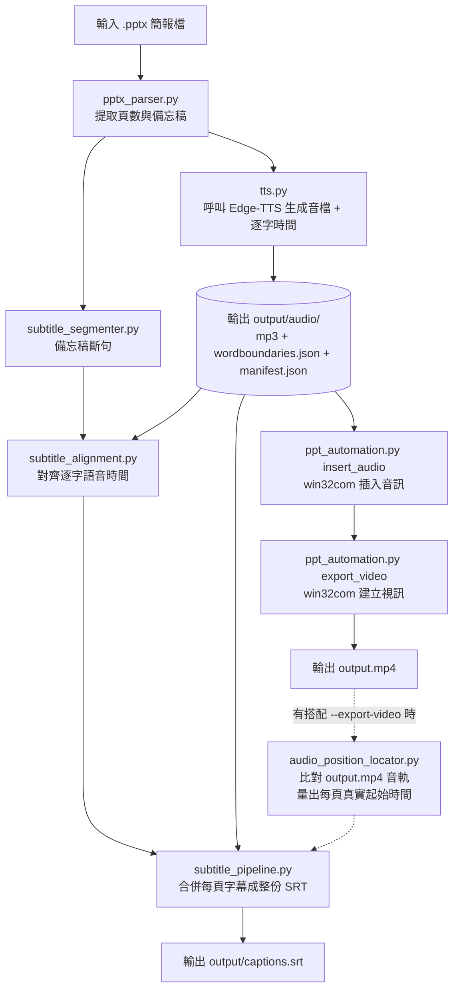

# PPTX Auto Presenter (`pptx2video`)

一個基於 Python 的自動化工具，可將 PowerPoint 簡報檔（`.pptx`）自動轉換成帶旁白配音、帶字幕的 MP4 影片：解析每頁的標題與備忘稿內容 → 透過 **Edge-TTS** 生成語音（同時取得逐字時間資料）→ 把音訊插入對應投影片 → 自動呼叫 PowerPoint 匯出 MP4；備忘稿同時也會被拆成適合當字幕的短句、對齊到實際語音時間，輸出一份完整的 SRT 字幕檔。**已完成 pptx → 配音 MP4 → 字幕生成流程，並在真實 Windows + PowerPoint 環境驗證過；字幕排版仍有已知的取捨情境（極短獨立段落、純英文行寬），詳見 [TODO.md](TODO.md)**。

- 版本歷史：[CHANGELOG.md](CHANGELOG.md)
- 還沒完成的工作與已知限制：[TODO.md](TODO.md)
- 架構設計、模組職責、PowerPoint COM 細節等開發者向內容：[PROJECT_HANDOVER.md](PROJECT_HANDOVER.md)

---

## ✨ 功能特色

- **解析 `.pptx` 投影片內容**：讀取投影片編號、標題與備忘稿，支援多頁簡報、長段落、換行與空白行，也能正確處理沒有備忘稿的頁面（例如封面/結尾頁）。
- **語音生成**：透過 `edge-tts` 把備忘稿轉成 MP3，依頁碼命名，支援語速/音高調整，失敗時有可設定次數的自動重試。
- **PowerPoint 音訊插入**：透過 `pywin32` COM 自動化把生成的 MP3 插入對應投影片，圖示縮小並移到右上角、盡量隱藏。
- **MP4 匯出自動化**：呼叫 PowerPoint「建立視訊」功能匯出 MP4，解析度/FPS/畫質/逾時秒數皆可透過 CLI 調整。
- **SRT 字幕生成**：把備忘稿依顯示寬度智慧斷行（中文用 `jieba` 斷詞避免切壞詞語，中英混排、標點、空白都有對應規則），對齊到 edge-tts 實際回報的逐字語音時間（不是估算），並依照每張投影片在最終影片裡的實際時長，合併成一份時間軸正確的完整 SRT 字幕檔。
- **完整例外分類與 Logging**：失敗情境依類型拋出對應例外，並區分「單頁跳過」與「整體中止」兩種處理策略；終端機維持簡潔輸出，log 檔案永遠保留完整 DEBUG 細節。

版本歷史與各功能導入的時間點請見 [CHANGELOG.md](CHANGELOG.md)。

---

## 🚀 快速開始（Windows）

以下步驟適合在 Windows PowerShell 中從 GitHub 下載這個專案後直接開始使用。

### 1. 下載專案

```powershell
git clone https://github.com/<your-username>/pptx2video.git
cd pptx2video
```

### 2. 建立虛擬環境

```powershell
py -3 -m venv .venv
```

### 3. 啟動虛擬環境

```powershell
.\.venv\Scripts\Activate.ps1
```

若 PowerShell 擋下執行腳本，可先執行：

```powershell
Set-ExecutionPolicy -ExecutionPolicy RemoteSigned -Scope CurrentUser
```

### 4. 安裝依賴套件

```powershell
python -m pip install --upgrade pip
pip install -r requirements.txt
```

> `pywin32` 只會在 Windows 環境安裝（`requirements.txt` 已用 `sys_platform == "win32"` 標記），在其他作業系統上執行 `pip install` 會自動跳過它。

### 5. 生成範例簡報（可選）

```powershell
python examples/create_sample_pptx.py
```

### 6. 執行解析流程

```powershell
python src/main.py examples/sample_test.pptx --output output/slides.json
```

或使用更像套件的方式：

```powershell
python -m pptx2video examples/sample_test.pptx --output output/slides.json
```

這會讀取簡報檔，解析每頁的標題與 notes，並輸出 JSON 到 [output/slides.json](output/slides.json)。

### 7. 生成語音（TTS）

```powershell
python -m pptx2video examples/sample_test.pptx --generate-audio --audio-output-dir output/audio --voice "zh-TW-YunJheNeural" --rate=-10% --pitch="+0Hz"
```

這會把有 notes 的投影片轉成 MP3，並在 `output/audio/manifest.json` 建立對應的音訊清單。

> `edge-tts` 直接把語音服務回傳的 MP3 位元組寫入檔案，**這個階段本身不需要安裝 ffmpeg**。ffmpeg 是在下一步「產生字幕」量測每張投影片實際音檔時長時才會用到（見下方需求說明）。

> 🔧 **這一步出錯、或事後想針對某幾頁重跑時**：不用整份 deck 重新跑一次（長講稿可能要一個多小時）。加 `--slides 6,9`（逗號分隔頁碼/區間，例如 `6,8-10`）只重新生成指定頁面，其他頁面已生成好的音檔跟 `manifest.json` 紀錄不會被動到。常見情境：某頁因為網路問題生成失敗、想針對某頁換一下 `--voice`/`--rate` 重試、或下面「疑似漏講偵測」警告某一頁有問題想重新生成確認。指令範例與細節見下方「⚠️ `--generate-audio` 疑似漏講偵測」小節。

### 8. 產生字幕（SRT）

只要有跑過 `--generate-audio`（這一步會順便把每張投影片的逐字語音時間存成 `slide_XXX.wordboundaries.json`），`--subtitles-output` 就會自動用這份時間資料產生對齊過的字幕，不需要額外參數：

```powershell
python src/main.py examples/sample_test.pptx --generate-audio --audio-output-dir output/audio --subtitles-output output/captions.srt
```

**不需要每次都跟 `--generate-audio` 寫在同一行**：如果音檔已經在之前的步驟 7（或更早的某次 `--generate-audio`）生成過，`output/audio/manifest.json` 已經存在，之後單獨執行 `--subtitles-output`（不加 `--generate-audio`）一樣會自動讀取這份既有的 manifest，正確產生有內容的字幕，**不會重新呼叫 edge-tts**：

```powershell
python src/main.py examples/sample_test.pptx --audio-output-dir output/audio --subtitles-output output/captions.srt
```

只有在 `output/audio/manifest.json` 真的不存在（例如整個專案都還沒跑過 `--generate-audio`，只想先解析 JSON）時，才會寫出一個合法但空白的 `.srt` 檔案，不會報錯。

> `pydub` 需要透過 `ffmpeg` 解碼 mp3 才能量測每張投影片實際的音檔時長（用來排出每張投影片在最終影片時間軸上的位置），所以這一步需要安裝 `ffmpeg` 並加入 PATH，見下方「需求與環境」。
>
> 字幕行的斷行/合併邏輯與時間對齊的設計細節，見 `src/subtitle_segmenter.py`、`src/subtitle_alignment.py`、`src/subtitle_pipeline.py` 的模組說明；已知的取捨（極短獨立段落、純英文行寬）記錄在 [TODO.md](TODO.md)。

> ⚠️ **這一步（mp4 還沒產生時）只會寫出「預測版」字幕，還不是最終準確版**：這個階段是把每張投影片自己音檔的實際長度依序加總，猜測每頁在最終影片裡的起始時間，假設投影片是「一張接一張、中間完全沒有空隙」播放——對短 deck 通常夠準，但長 deck 可能到後面累積偏差到好幾秒（見 CHANGELOG v0.6.0）。**真正準確的版本要等 Step 10 匯出 MP4 時，把 `--subtitles-output` 跟 `--export-video` 寫在同一行才會產生**（程式會拿實際匯出的影片重新量測每頁真實起始時間，覆寫掉這裡的預測版）——細節見 Step 10 的說明，這裡先產生的版本純粹是給你先睹為快、或在還沒匯出影片前抓字幕內容有沒有問題用的。

> 🔧 **想在不重新呼叫 edge-tts 的情況下驗證字幕/漏講狀況**：`--generate-audio` 每次都會附帶重新產生字幕，而這一步會重新處理**整份** deck 既有的 manifest/wordboundaries 資料，不只是剛才用 `--slides` 重新生成的那幾頁——換句話說，就算只重生一頁，其他頁的舊資料也會被目前的程式碼重新比對一次。想單獨確認（不管是想看某幾頁有沒有漏講、或想在不跑一次 `--generate-audio` 的情況下重新檢查全部頁面）用 `scripts/check_narration_gaps.py`，純本機比對、秒級完成，細節見下方「⚠️ `--generate-audio` 疑似漏講偵測」小節。

### ⚠️ `--generate-audio` 疑似漏講偵測（`POSSIBLE DROPPED NARRATION`）

背景：實際使用中發現過一次 edge-tts **完全沒有錯誤訊息、卻悄悄漏講一整段備忘稿內容**的情況（某頁備忘稿裡連續兩個要點、約 300 字，語音直接跳過沒有唸出來，`WordBoundary` 事件的時間戳記從前一段幾乎沒有停頓就跳到下一段）。這跟「標點符號、空白沒有各自的 WordBoundary 事件」這種已知、正常的現象不同——這是語音內容本身真的少了一大段。

`--generate-audio` 現在每頁生成完音檔後，會自動比對「這一頁 WordBoundary 事件之間的時間間隔」跟「這一頁自己的平均語速」，如果某個間隔明顯短於它涵蓋的文字量該有的時間，就會印出一行警告：

```
WARNING - POSSIBLE DROPPED NARRATION - slide 9: edge-tts's audio has only 4.0s around 312.3s
where ~52s was expected for this much source text. Listen to slide_009.mp3 around 312.3s to
confirm. Skipped text: '因此，Flash 的第四個特性...（後略）'
```

看到這個警告代表**建議實際打開該頁的 mp3、跳到警告標出的時間點附近用耳朵確認**——這是啟發式判斷，不是絕對保證（依據見 [TODO.md](TODO.md) 已知限制），但目前唯一一次真實遇到的案例已驗證能準確抓到。沒有看到這個警告不代表 100% 沒問題，只是目前沒有工具能做到不需要人耳確認就 100% 保證正確；這個警告的作用是把「該去聽哪一頁、聽哪個時間點」的範圍大幅縮小，不用整份講稿逐頁逐句盲聽。

**只重新生成/檢查特定頁面**：如果只是想針對某一頁（例如收到警告的那一頁）重跑或重新檢查，不用整份 deck 重新跑一次（長講稿跑一次可能要一個多小時），有兩種情況：

- **手上還沒有這一頁的音檔/wordboundaries 資料**，或想確認 edge-tts 這次會不會又漏講：用 `--slides` 只重新生成指定頁面，不會動到其他頁面已經生成好的音檔跟 `manifest.json` 紀錄：

  ```powershell
  python src/main.py examples/sample_test.pptx --generate-audio --audio-output-dir output/audio --slides 6,9 --no-file-log
  ```

  `--slides` 接受逗號分隔的頁碼跟區間，例如 `6,9` 或 `6,8-10`。指定到 deck 裡不存在的頁碼會直接報錯中止。

- **手上已經有這一頁的音檔/wordboundaries 資料**（例如之前完整跑過一次），只是想重新跑一次疑似漏講檢查、或想用不同的敏感度門檻重新檢查：用 `scripts/check_narration_gaps.py`，完全不會呼叫 edge-tts，是純本機比對，秒級完成：

  ```powershell
  python scripts/check_narration_gaps.py --manifest output/audio/manifest.json --slides-json output/slides.json --slides 6,9
  ```

  沒有 `output/slides.json` 的話可以改用 `--pptx examples/sample_test.pptx` 直接從簡報重新抽取備忘稿文字。不加 `--slides` 就是檢查整份 deck 裡每一頁有資料可查的投影片。找到疑似漏講內容時結束代碼是 `1`，方便串進其他腳本判斷；沒問題或該頁沒有可檢查的資料則是 `0`。

### 9. 把音訊插入 PPTX（需要 Windows + PowerPoint）

```powershell
python src/main.py examples/sample_test.pptx --insert-audio --audio-output-dir output/audio --pptx-output output/deck_with_audio.pptx --verbose
```

這會透過 `pywin32` 開啟 PowerPoint，把每頁對應的 MP3 插入該投影片，圖示縮小並移到右上角，且盡量在非播放狀態隱藏。沒有音檔的頁面（例如封面/結尾頁）完全不會被更動。

> ⚠️ **重要（實測結論）**：插入後在 PowerPoint 編輯畫面裡，音訊的 Start 設定仍會顯示「按一下時」，用「投影片放映」現場播放時需要多點一下音符圖示才會出聲——這是已知限制，目前尚未解決（詳見下方「已知限制」）。**但這不影響用 PowerPoint「建立視訊」匯出 MP4**：匯出時每頁會自動依照音檔實際長度撥放並切換頁面，不需要額外設定轉場秒數（技術原因見 [PROJECT_HANDOVER.md](PROJECT_HANDOVER.md) 的 PowerPoint COM 特性說明）。

> 🔧 **如果剛才用 `--slides` 只重新生成了某幾頁的音檔**：這一步（跟下面的匯出 MP4）沒有頁面篩選機制，只要有任何一頁音檔換過，就需要對整份 `deck_with_audio.pptx` 重跑一次插入音訊；不會因為只重生一頁就漏掉，但也不能只插入那一頁——`--insert-audio` 一律是整份 deck 重新插入。

> ℹ️ **這一步不會動到字幕**：`--insert-audio` 只負責把音訊插入 pptx，跟 `captions.srt` 完全無關——不管這一步跑幾次，字幕檔都還是停在 Step 8 產生的那個版本（或更早的版本），要更新字幕請看下一步。

### 10. 匯出 MP4（已自動化，需要 Windows + PowerPoint）

> ⚠️ **這一步跟步驟 9 是接續關係，不是各自獨立的兩步驟**：`--insert-audio` 和 `--export-video` 可以在**同一行指令**裡一起下，程式會依序完成「插入音訊 → 匯出影片」。**不要把步驟 9 的指令跑完，再另外跑一次帶 `--insert-audio` 的步驟 10 指令**——那樣會讓插入音訊的動作被多做一次（重新開一次 PowerPoint、重新插一次音訊），純粹浪費時間。下面依你的情境選其中一種指令即可：

**情境 A：第一次跑，插入音訊跟匯出一次到位（跳過步驟 9，直接執行這一行就好）**

```powershell
python src/main.py examples/sample_test.pptx --insert-audio --audio-output-dir output/audio --pptx-output output/deck_with_audio.pptx --export-video --video-output output/deck.mp4 --subtitles-output output/captions.srt --verbose
```

**情境 B：已經照步驟 9 插好音訊了，只想匯出（不要再加 `--insert-audio`）**

```powershell
python src/main.py output/deck_with_audio.pptx --export-video --video-output output/deck.mp4 --subtitles-output output/captions.srt
```

兩種情境都會自動呼叫 PowerPoint「建立視訊」功能匯出 MP4（預設 720p、不使用錄製時間、沒有音訊的頁面固定顯示 5 秒），並即時印出匯出進度，例如：

```
Exporting video... status: queued
Exporting video... status: in_progress
Exporting video... status: done
Exported video to D:\...\output\deck.mp4 (42.3s)
```

已在真實 Windows + PowerPoint 環境驗證：影片可以正確產生，語音與每頁時長都對齊。

> ⚠️ `Presentation.CreateVideo()` 是非同步 API，匯出時間會依投影片數量與解析度而定，可能長達數十秒到數分鐘。程式會輪詢匯出狀態，並設有逾時保護（預設 3600 秒，可用 `--video-timeout` 調整）。

> 🔧 **同上一步的提醒**：因為 `--insert-audio` 是整份 deck 重新插入，只要走了一次（即使起因只是某一頁音檔用 `--slides` 重生），這一步（匯出 MP4）也要跟著整份重跑，才能讓影片反映最新的音檔內容；不能只匯出某幾頁。

> ⚠️ **字幕在這一步要不要一併更新，取決於這行指令有沒有加 `--subtitles-output`**：上面兩個範例都刻意加了這個參數——只有跟 `--export-video` **寫在同一行**，程式才會在匯出完成後，改用剛產生的真實 mp4 重新量測每頁起始時間，把 Step 8 的「預測版」字幕升級成「真實起始時間版」（比較準，尤其是長 deck）。如果這一步的指令沒加 `--subtitles-output`（例如只想先匯出影片，字幕晚點再說），`captions.srt` 完全不會被更新，會停留在 Step 8 產生的版本。
>
> **如果已經匯出完才想到要更新字幕，不需要重新匯出一次**，用 `scripts/regenerate_srt_from_export.py` 直接對著現有的 mp4 重新量測就好：
>
> ```powershell
> python scripts/regenerate_srt_from_export.py --video output/deck.mp4 --manifest output/audio/manifest.json --slides-json output/slides.json --output output/captions.srt
> ```

### 11. 一次到底：單一指令完成整個流程

上面 1～10 是拆開一步步介紹，方便逐步理解與除錯；但實際使用時**不需要分開下指令**，所有步驟（解析 → 生成語音 → 輸出 JSON → 生成字幕 → 插入音訊 → 匯出 MP4）都可以寫在同一行指令裡，`main.py` 會依序自動完成：

```powershell
python src/main.py examples/sample_test.pptx `
  --output output/slides.json `
  --generate-audio `
  --audio-output-dir output/audio `
  --voice "zh-TW-YunJheNeural" `
  --rate=-10% `
  --pitch="+0Hz" `
  --subtitles-output output/captions.srt `
  --insert-audio `
  --pptx-output output/deck_with_audio.pptx `
  --export-video `
  --video-output output/deck.mp4 `
  --verbose
```

執行時會依序印出每個階段的進度：

```
Parsing PowerPoint file: ...
Loaded 5 slide(s)
Generating audio 1/3 (slide 2)...
Generating audio 2/3 (slide 3)...
Generating audio 3/3 (slide 4)...
Generated 3 audio file(s) in output/audio
Saved JSON to output\slides.json
Inserted audio into 3 slide(s); skipped 0. Saved to ...\deck_with_audio.pptx
Exporting video... status: queued
Exporting video... status: in_progress
Exporting video... status: done
Exported video to ...\deck.mp4 (42.3s)
Saved subtitles to output\captions.srt
```

**注意事項：**
- 生成語音需要能連上 Edge-TTS 服務（`speech.platform.bing.com`）
- 插入音訊與匯出 MP4 都需要 Windows + 已安裝 PowerPoint + `pywin32`
- 這一行指令裡 PowerPoint 實際上會被開關兩次：`--insert-audio` 用一次、`--export-video` 又用一次，不是同一個 PowerPoint session 做完兩件事。不影響結果，只是多花一點點時間（優化方向見 [PROJECT_HANDOVER.md](PROJECT_HANDOVER.md) 的「未來擴充方向」）。
- **`Saved subtitles to ...` 這一行會排在 `Exported video to ...` 之後，不是之前**：因為這一行指令同時有 `--subtitles-output` 跟 `--export-video`，程式會等影片真的匯出完成，才用真實起始時間法產生字幕（見 Step 8、10 的說明），所以字幕是整個流程的最後一步才寫出，不是預測版。這也是這一行指令（相對於分開下 Step 7～10）額外的好處：**不用像分開下指令那樣還要手動記得把 `--subtitles-output` 加進匯出那一行**，一次到底自然就是正確、最終的版本。

> 🔧 **這一行指令適合第一次跑整份 deck；事後針對個別頁面除錯或驗證，改回步驟 7～10 分開下指令**。這一行本身**沒有** `--slides` 篩選（`--slides` 只影響 `--generate-audio` 這一段），所以如果只是想重新生成/檢查某一頁，直接照這行整份重跑一次不會比較快，反而失去 `--slides` 省下重新呼叫 edge-tts 的意義。建議流程：先用步驟 7 的 `--slides` 只重生有問題的那幾頁 → 需要的話用 `scripts/check_narration_gaps.py`（步驟 8 小節）或聽 mp3 確認沒問題 → 再用步驟 9＋10（一次下也可以，兩者本來就要接續，記得帶上 `--subtitles-output` 才會一併更新成準確版）整份重新插入音訊、匯出影片。

---

## 📋 CLI 完整指令與參數說明

### 基本用法

```powershell
python src/main.py <pptx_path> [選項...]
```

或：

```powershell
python -m pptx2video <pptx_path> [選項...]
```

`<pptx_path>`（必填）：輸入的 `.pptx` 簡報檔路徑。

### 參數總表

| 參數 | 預設值 | 說明 |
|---|---|---|
| `--output`, `-o` | `output/slides.json` | 解析結果 JSON 的輸出路徑 |
| `--pretty` | `False`（flag） | 額外把 JSON 結果美化印到終端機（若沒指定 `--output` 也會自動印出） |
| `--indent` | `2` | JSON 輸出的縮排空白數 |
| `--verbose` | `False`（flag） | 印出更詳細的執行進度訊息 |
| `--strict` | `False`（flag） | 若任何一頁沒有 notes，直接中止並回報錯誤（適合用於檢查簡報是否漏寫備忘稿） |
| `--generate-audio` | `False`（flag） | 啟用語音生成，會呼叫 edge-tts 把每頁 notes 轉成 MP3 |
| `--audio-output-dir` | `output/audio` | 生成的 MP3 與 `manifest.json` 存放目錄（需搭配 `--generate-audio` 才有作用） |
| `--voice` | `Microsoft Server Speech Text to Speech Voice (zh-TW, YunJheNeural)` | edge-tts 使用的語音。也可用簡短格式如 `zh-TW-YunJheNeural`，若完整格式在你的環境報錯可改用簡短格式 |
| `--rate` | `-10%` | 語速調整，語音會比原始語速慢 10%；正值加快、負值放慢，例如 `+10%`、`-20%`。⚠️ **負值務必用 `--rate=-20%` 等號寫法**，不要用空格分隔的 `--rate "-20%"`（見下方說明） |
| `--pitch` | `+0Hz` | 音高調整，預設不改變音高 |
| `--tts-max-retries` | `3` | edge-tts 生成失敗後（僅限判斷為暫時性的網路/服務錯誤）最多重試幾次，設為 `0` 停用重試。**必須是 0 或正整數**，帶負值會直接被 CLI 拒絕並提示錯誤 |
| `--tts-retry-delay` | `2.0`（秒） | 兩次重試之間的等待秒數 |
| `--subtitles-output` | `output/captions.srt` | 字幕輸出路徑，每次執行都會自動產生；需要 `--generate-audio`（或既有的 `manifest.json`）提供的逐字語音時間才能產出有內容的字幕，否則會寫出空白 `.srt`。**這次執行有沒有同時加 `--export-video` 會決定用哪種對齊方式**：沒有的話用「預測版」（加總每頁音檔時長猜位置，Step 8）；有的話會等匯出完成後才寫出，改用「真實起始時間版」（比對實際影片音軌量測，Step 10，較準）——見下方 Step 8／10 的說明 |
| `--insert-audio` | `False`（flag） | 把已生成的音訊插入 PPTX 對應投影片，圖示縮小移到右上角並盡量隱藏。需要 Windows + PowerPoint + pywin32，且需已用 `--generate-audio` 產生過音檔（或指定的 `--audio-output-dir` 底下已有 `manifest.json`） |
| `--pptx-output` | 覆蓋輸入檔 | 搭配 `--insert-audio` 使用，指定插入音訊後另存的 PPTX 路徑；未指定則直接覆蓋原始輸入檔 |
| `--insert-audio-timeout` | `1800`（秒） | `--insert-audio` 等待整個插入+存檔流程完成的逾時秒數。若 PowerPoint 卡住，超過這個時間會拋出錯誤，而不是無限期卡住。設為 `0` 可恢復成無限期等待 |
| `--export-video` | `False`（flag） | 用 PowerPoint「建立視訊」功能匯出 MP4。需要 Windows + PowerPoint + pywin32。若同時有 `--insert-audio`，會匯出剛插入音訊的那份；否則直接匯出 `pptx_path`（或 `--pptx-output` 指定的檔案） |
| `--video-output` | PPTX 路徑改副檔名為 `.mp4` | 搭配 `--export-video` 使用，指定匯出的 MP4 路徑 |
| `--video-resolution` | `720` | 匯出解析度（垂直像素），對應 PowerPoint 預設選項：`480`（標準）、`720`（HD）、`1080`（Full HD）、`2160`（4K）；寬度會依投影片比例自動計算 |
| `--video-fps` | `30` | 匯出影片的每秒畫面格數 |
| `--video-quality` | `85` | 編碼品質，0–100（PowerPoint 官方預設值就是 85） |
| `--video-default-duration` | `5.0` | 沒有錄製時間、也沒有自動播放音訊的頁面（例如封面頁）要停留幾秒，對應 PowerPoint 匯出視窗的「每張投影片所用秒數」 |
| `--video-use-recorded-timings` | `False`（flag） | 是否改用簡報錄製的時間/旁白，而不是 `--video-default-duration` / 音訊時長驅動的時間。預設關閉，對應 PowerPoint「不使用錄製的時間和旁白」選項 |
| `--video-timeout` | `3600`（秒） | 等待 PowerPoint 匯出完成的逾時秒數，投影片數量多或解析度高時建議調大 |
| `--global-scale-correction` | `1.0`（不修正） | 只在 `--subtitles-output` 搭配 `--export-video`（真實起始時間對齊模式）時有作用。修正一個跟已播放時間成正比、環境相依的字幕時間系統性偏差（詳見 CHANGELOG v0.6.1 第四輪修正）。**這不是通用常數**，每份 deck/每台機器可能需要不同的值（甚至不需要），必須自行校準：**免動手**用 `scripts/verify_srt_accuracy.py`（會自動跑交叉比對並回歸出建議值，不需要 Audacity/人耳確認，推薦先試這個），或想要有人耳驗證、較高可信度時用 `scripts/calibrate_scale.py`（手動核對幾個真實時間點）——都在下方「🎯 校準 `--global-scale-correction`」有完整流程 |
| `--log-dir` | `logs` | 存放帶日期檔名 log 檔的資料夾（例如 `logs/2026-07-28.log`）。這個檔案**永遠記錄完整 DEBUG 細節，不受 `--verbose` 影響**，方便事後除錯 |
| `--no-file-log` | `False`（flag） | 停用寫入 log 檔案，只印到終端機 |

> ⚠️ **關於 `--rate` 負值的一個 Python argparse 陷阱**：像 `--rate "-10%"` 這種用空格分隔、值又以 `-` 開頭的寫法，會被 `argparse` 誤判成另一個選項旗標而報錯 `expected one argument`（`--pitch` 因為預設是 `+0Hz`，以 `+` 開頭，不受影響）。**負值請一律用等號寫法**，例如：`--rate=-20%`（等號連在一起、不要空格）。加速（正值）用空格或等號都可以，例如 `--rate "+10%"` 或 `--rate=+10%` 皆正常。

### 使用範例

**只解析、不生成語音，並在終端機印出美化後的 JSON：**

```powershell
python src/main.py examples/sample_test.pptx --pretty
```

**嚴格模式，檢查是否有頁面漏寫 notes：**

```powershell
python src/main.py examples/sample_test.pptx --strict
```

**生成語音，使用加快 10% 的語速：**

```powershell
python src/main.py examples/sample_test.pptx --generate-audio --rate "+10%"
```

**指定輸出到自訂資料夾，並顯示詳細訊息：**

```powershell
python src/main.py examples/sample_test.pptx --output output/my_slides.json --audio-output-dir output/my_audio --generate-audio --verbose
```

**只把已生成的音訊插入 PPTX，另存新檔，不覆蓋原始檔案：**

```powershell
python src/main.py examples/sample_test.pptx --insert-audio --audio-output-dir output/audio --pptx-output output/deck_with_audio.pptx
```

**只匯出 MP4（假設已經有插好音訊的 pptx），用 1080p 匯出：**

```powershell
python src/main.py output/deck_with_audio.pptx --export-video --video-output output/deck.mp4 --video-resolution 1080
```

**完整流程（解析 + 語音 + 字幕 + 插入音訊 + 匯出 MP4）：** 指令見上方「11. 一次到底：單一指令完成整個流程」，這裡不重複貼一次。

---

## 🎯 校準 `--global-scale-correction`

真實起始時間對齊模式（`--subtitles-output` + `--export-video`）量出來的時間，帶有一個跟已播放時間成正比、環境相依的系統性偏差（詳見 CHANGELOG v0.6.1 第四輪修正）。這不是通用常數，換一份 deck 或換一台機器，理論上都需要重新校準。

### 想要免動手：`scripts/verify_srt_accuracy.py` 自動估算（推薦先試這個）

如果不想每次都要開 Audacity 手動核對時間點，`scripts/verify_srt_accuracy.py`（本來是用來驗證字幕準確度的工具，見下方「📁 專案結構」）現在也會**自動**從自己抽樣比對出來的資料，回歸算出一個建議的 `--global-scale-correction` 值——不需要人耳確認、不需要 Audacity：

```powershell
python scripts/verify_srt_accuracy.py --video output/deck.mp4 --manifest output/audio/manifest.json --slides-json output/slides.json
```

跑完會在最後印出建議值跟套用後的 RMS／最大殘差，例如：

```
Suggested --global-scale-correction (fitted from the 42 sample(s) above, no manual measurement needed): 1.00118
Residual after applying it: RMS 0.041s, max 0.187s across the sampled words.
```

拿到建議值後直接套用即可：

```powershell
python scripts/regenerate_srt_from_export.py --video output/deck.mp4 --manifest output/audio/manifest.json --slides-json output/slides.json --output output/captions.srt --global-scale-correction 1.00118
```

這個方法的取捨：樣本是機器自動挑、自動比對出來的，沒有獨立的人耳驗證當作對照組；deck 越長、抽樣的字越多，估出來的值越可靠，短 deck 或想要最高準確度時，建議還是跟下面手動校準流程的結果交叉核對一次。加大 `--samples-per-slide`（預設 3）可以增加抽樣密度，讓估算更穩定。

### 手動校準流程（想要最高準確度、或想交叉驗證自動估算結果時使用）

`scripts/calibrate_scale.py` 是手動校準的工具——需要你自己實際核對過幾個真實時間點，換來的是有獨立人耳驗證過的校準值，適合用在準確度真的很重要的場合。

### 使用流程

1. 先用預設值（不加 `--global-scale-correction`，等同 1.0）跑一次完整流程，產出未校正的 `output/deck.mp4` 與 `output/audio/manifest.json`。
2. 挑 5～8 個（越分散越好，deck 的頭、中、尾都要有）投影片，用能顯示精確時間戳的方式（見下方「怎麼量真實時間」），量出這幾頁旁白**真正開始出聲**的真實秒數。
3. 把量到的時間存成一個 JSON 檔（見下方「`my_observations.json` 的格式」），檔名建議固定用 `my_observations.json`（已加進 `.gitignore`，不會被誤 commit）。
4. 執行：

```powershell
python scripts/calibrate_scale.py `
  --video output/deck.mp4 `
  --manifest output/audio/manifest.json `
  --slides-json output/slides.json `
  --observations my_observations.json `
  --report calibration_report.json
```

腳本會印出建議的 `--global-scale-correction` 值，以及套用後的 RMS／最大殘差供你判斷擬合品質。`--report` 是選用的，會多寫一份 `calibration_report.json`（同樣已加進 `.gitignore`），內含逐頁的量測值/觀測值/殘差，方便之後回頭檢查是否有特定頁面殘差異常大。

### `my_observations.json` 的格式

一個 JSON 物件，key 是投影片編號（字串或數字都可以），value 是你量到的真實秒數：

```json
{
  "2": 5.12,
  "6": 2173.22,
  "11": 4891.03,
  "17": 7950.03,
  "20": 9105.27
}
```

注意事項：

- 每個 key-value 後面（除了最後一個）都要有逗號，這是最容易手誤的地方（JSON 語法錯誤會直接讓腳本在讀檔那一步就報錯）。
- value 量的是「這一頁旁白**開始出聲**的瞬間」，不是「畫面切換」的瞬間——這兩者通常幾乎同一時刻，但如果某頁有轉場動畫、或想要最準的結果，請以聲音為準（見下一節）。

### 怎麼量真實時間

**不建議**只用眼睛看畫面配合耳朵聽音量來抓，很難抓到小於一秒的精確度。推薦做法是只處理音訊、不用管畫面：

1. 用 ffmpeg 把 `output/deck.mp4` 的音軌單獨抽出來：`ffmpeg -i output/deck.mp4 -vn -acodec pcm_s16le output_audio.wav`
2. 用免費的 **Audacity** 打開這個 wav 檔（如果不知道大概要找哪個位置，可以先用預設值跑一次 `scripts/dump_slide_bounds.py`，拿它算出來的粗略、未校正時間當作放大搜尋的起點——這個值本身有偏差，但拿來定位大概位置綽綽有餘）。
3. 放大時間軸，找到波形從一片平坦（靜音）第一次明顯跳出波峰的轉折點，把游標點在那裡。
4. Audacity 下方選取工具列會直接顯示精確到毫秒的時間戳，換算成秒填進 `my_observations.json`。

這個方法不需要處理畫面、不需要 frame-by-frame 的影片剪輯軟體，精確度（約 ±0.05～0.1 秒）也遠遠超過校準這個偏差所需要的水準——回歸用的是最小平方法，觀測點時間跨度越大，同樣的量測誤差對算出來的係數影響就越小。

### 產出的兩個檔案不需要進版控

`my_observations.json`（你自己量的時間，因人/因deck而異）跟 `calibration_report.json`（腳本產出的擬合記錄）都已經加進 `.gitignore`，不會被 `git add -A` 之類的指令意外收進去。如果你想留存某次校準的記錄，用檔名另存（例如 `calibration_report_2h40m_deck.json`）並手動決定要不要加進版控，不要用預設檔名去 commit。

---

## 📁 專案結構

```text
pptx2video/
├── src/                     # 主要程式碼
│   ├── main.py                   # CLI 入口與 JSON 輸出
│   ├── pptx_parser.py            # 解析 .pptx 與 notes
│   ├── tts.py                    # edge-tts 音訊生成，含逐字時間（WordBoundary）擷取
│   ├── subtitle_segmenter.py     # 字幕斷句：備忘稿 → 適合當一行字幕的片段（純文字，不涉及時間）
│   ├── subtitle_alignment.py     # 字幕對齊：把斷好的片段對齊到實際語音時間，輸出 SRT 文字
│   ├── subtitle_pipeline.py      # 字幕合併：多投影片依實際時間軸合併成一份完整 SRT
│   ├── ppt_automation.py         # PowerPoint COM 自動化：插入音訊、匯出 MP4
│   ├── exceptions.py             # 自訂例外階層
│   ├── logging_config.py         # 統一 Logging 設定
│   └── __init__.py
├── pptx2video/          # 套件入口（`python -m pptx2video ...` 用的就是這個）
│   ├── __init__.py
│   └── __main__.py
├── tests/               # 測試檔案
│   ├── test_pptx_parser.py
│   ├── test_tts_generator.py
│   ├── test_tts_word_boundaries.py
│   ├── test_subtitle_segmenter.py
│   ├── test_subtitle_alignment.py
│   ├── test_subtitle_pipeline.py
│   ├── test_ppt_automation.py
│   ├── test_logging_config.py
│   ├── test_main_payload.py
│   └── test_cli_end_to_end.py
├── scripts/             # 手動驗證腳本（需要真實網路/Windows+PowerPoint，不在自動化測試涵蓋範圍內）
│   ├── smoke_test_word_boundaries.py
│   ├── smoke_test_alignment.py
│   ├── verify_slide_timing.py
│   ├── verify_tts_alignment.py
│   ├── verify_srt_accuracy.py            # 逐字交叉比對真實匯出影片，順便自動回歸出 --global-scale-correction 建議值（不需人耳/Audacity）
│   ├── regenerate_srt_from_export.py
│   ├── dump_slide_bounds.py
│   ├── calibrate_scale.py                # 從幾個「手動」核對過的真實播放時間，回歸推算出 --global-scale-correction 的建議值（有人耳驗證，較可信但較費工）
│   └── sample_notes_for_smoke_test.txt   # 上面腳本用的範例備忘稿文字
├── examples/            # 範例腳本與範例簡報
├── output/              # 輸出檔案（已加入 .gitignore，不進版控）
├── logs/                # 帶日期的 log 檔案（已加入 .gitignore，不進版控）
├── temp/                # 暫存資料夾
├── requirements.txt     # Python 相依套件
├── pyproject.toml       # 專案設定
├── LICENSE              # 授權條款
├── CHANGELOG.md         # 版本歷史
├── TODO.md              # 待辦事項與已知限制
├── PROJECT_HANDOVER.md  # 架構與開發者交接文件
└── README.md            # 本文件
```

模組職責的詳細說明（每個檔案負責什麼、彼此如何協作）請見 [PROJECT_HANDOVER.md](PROJECT_HANDOVER.md) 的「每個模組的責任範圍」章節。

---

## 🪵 錯誤處理與 Logging

專案有自訂例外階層與正式 Logging，取代單純依賴 `print()` 跟通用 `RuntimeError` 的做法。

### 自訂例外階層（`src/exceptions.py`）

所有 pptx2video 自己拋出的例外都繼承自 `Pptx2VideoError`，方便統一捕捉，也能依情境個別處理：

| 例外類別 | 觸發情境 |
|---|---|
| `PptParseError` | `.pptx` 檔案損毀、格式不支援，或其他解析失敗 |
| `TTSGenerationError` | edge-tts 生成語音失敗（網路問題、服務錯誤、缺少 ffmpeg 等），訊息會標明是第幾頁失敗 |
| `PowerPointLaunchError` | PowerPoint 無法啟動，或簡報檔無法開啟（非 Windows 環境、pywin32 缺失、COM 呼叫失敗等） |
| `AudioInsertionError` | 插入音訊後無法儲存 PPTX（單一頁面的插入失敗會記錄成 `skipped_slides`，不會拋出這個例外） |
| `AudioInsertionTimeoutError` | `--insert-audio-timeout` 等待逾時（同時也是 `AudioInsertionError` 與內建 `TimeoutError` 的子類別） |
| `VideoExportError` | PowerPoint 回報匯出失敗，或回報完成但找不到輸出檔案 |
| `VideoExportTimeoutError` | 匯出等待超過 `--video-timeout` 設定的秒數（同時也是內建 `TimeoutError` 的子類別） |

`FileNotFoundError`、`ValueError` 這類 Python 內建例外在語意上已經很清楚（例如「找不到輸入檔案」），故意保留不重新包裝。

### Logging（`src/logging_config.py`）

- **終端機輸出維持簡潔風格**（沒有時間戳記，`--verbose` 才會顯示更細節的訊息）
- **log 檔案（`logs/YYYY-MM-DD.log`）永遠記錄完整 DEBUG 等級細節，不受 `--verbose` 影響**——就算這次沒加 `--verbose`，log 檔案還是會完整記下所有過程，方便事後除錯或回報問題時附上
- 如果 log 資料夾無法建立或寫入（例如唯讀檔案系統），會在終端機印出警告並自動降級成只在終端機輸出，不會讓整個程式當掉
- 可用 `--log-dir` 指定其他資料夾，或用 `--no-file-log` 完全停用檔案記錄

範例：跑完一次指令後，檢查發生了什麼事

```powershell
python src/main.py examples/sample_test.pptx --generate-audio
type logs\2026-07-28.log
```

### 錯誤處理策略（Skip vs Abort）

程式對每一種失敗情境，都明確分成兩類處理方式：

- **Skip（跳過）**：只影響單一投影片，不影響其他頁的處理結果。記錄下來（`skipped_slides` 或 log 裡的 `WARNING`），流程繼續跑完。
- **Abort（中止）**：影響整個操作能不能繼續進行下去，直接停止並回報錯誤。

判斷原則：**如果失敗只跟某一頁投影片的內容/資源有關，且不影響其他頁的處理，用 Skip；如果失敗會讓後續步驟根本無法進行（缺少必要的輸入、外部程式無法啟動、結果無法儲存），用 Abort。**

| 情境 | 行為 | 說明 |
|---|---|---|
| 投影片沒有 notes | Skip | 正常情況（例如封面/結尾頁），`has_notes: false`，不生成音訊 |
| `--strict` 模式下有頁面沒有 notes | Abort | 使用者主動選擇的嚴格模式，用來檢查簡報是否漏寫備忘稿 |
| TTS 生成失敗（任一頁） | **Abort**（fail fast） | TTS 失敗很多時候是系統性問題（服務掛掉、網路整個斷線），fail fast 能立刻讓使用者知道，而不是等所有頁面都跑過一輪失敗才發現 |
| `--insert-audio` 時某頁音檔缺失 | Skip | 記錄進 `skipped_slides`，其他頁繼續插入 |
| `--insert-audio` 時某投影片編號不存在 | Skip | 記錄進 `skipped_slides` |
| PPTX 檔案不存在 | Abort | 沒有輸入檔案，後續步驟無法進行 |
| PowerPoint 無法啟動 / 無法開啟簡報 | Abort | 後續所有 COM 操作都建立在這一步成功的前提上 |
| `--insert-audio` 存檔失敗 / 逾時 | Abort | 已完成的插入工作無法保存，或 PowerPoint 卡住太久，繼續等待也沒有意義 |
| MP4 匯出失敗 / 逾時 | Abort | PowerPoint 的匯出是全有或全無，沒有「匯出一半」的中間狀態 |

這些決策背後的取捨（例如為何 TTS 失敗選擇 fail fast、為何 COM 操作不做自動重試）記錄在 [PROJECT_HANDOVER.md](PROJECT_HANDOVER.md)。

---

## 🧪 執行測試

跑全部測試：

```powershell
python -m unittest discover -s tests -v
```

只跑單一模組的測試，例如只測 parser：

```powershell
python -m unittest tests.test_pptx_parser -v
```

其他可單獨測試的模組：

```powershell
python -m unittest tests.test_tts_generator -v
python -m unittest tests.test_tts_word_boundaries -v
python -m unittest tests.test_subtitle_segmenter -v
python -m unittest tests.test_subtitle_alignment -v
python -m unittest tests.test_subtitle_pipeline -v
python -m unittest tests.test_ppt_automation -v
python -m unittest tests.test_logging_config -v
python -m unittest tests.test_main_payload -v
python -m unittest tests.test_cli_end_to_end -v
```

> `test_ppt_automation.py` 用假的 COM 物件模擬 PowerPoint，不需要真的安裝 PowerPoint 也能在任何作業系統跑，但這不能取代在真實 Windows + PowerPoint 環境的實測。
>
> `test_cli_end_to_end.py` 直接呼叫 `src.main.main()`（跟真正的 CLI 入口一樣的路徑），涵蓋解析、`--generate-audio`（mock 掉 edge-tts 網路呼叫）、字幕產生、`--strict`、`--pretty`、錯誤處理等完整流程，補足其他測試模組只測個別函式、沒有測過 `main()` 本身的缺口。同樣因為需要真的 Windows + PowerPoint，`--insert-audio`/`--export-video` 不在這個模組的涵蓋範圍內。
>
> `test_tts_word_boundaries.py`、`test_subtitle_segmenter.py`、`test_subtitle_alignment.py`、`test_subtitle_pipeline.py` 涵蓋的是逐字時間擷取、字幕斷句、時間對齊、多投影片合併這幾個各自獨立的環節，都用假資料（不需要真的連網或裝 PowerPoint）；實際對真實 edge-tts/PowerPoint 輸出的驗證見上方 `scripts/` 底下的手動驗證腳本。

---

## ⚠️ 已知限制（摘要）

* **PowerPoint 編輯畫面 / 現場放映模式仍需點擊音符圖示才會播放**：插入音訊後，PowerPoint 編輯 UI 顯示的 Start 設定固定是「按一下時」，用「投影片放映」模式現場簡報時需要多點一下才會出聲。**已確認不影響匯出的 MP4 影片**，目前刻意不處理這個情境，優先確保匯出正確。
* **`PlayOnEntry` 旗標的必要性尚未完全理解原理，僅為實測結論**：拿掉這個舊版旗標會讓匯出的 MP4 完全沒聲音、且每頁變回固定 5 秒，即使編輯 UI 上完全看不出差異。
* **`CreateVideoStatus` 的狀態列舉值是依 Microsoft 官方文件假設，未逐一比對所有 PowerPoint 版本**：程式碼已加安全網（回報完成後仍會檢查輸出檔案是否存在、非空）降低風險。
* **`insert_audio()` 的逾時（`--insert-audio-timeout`）只能停止等待，無法強制關閉卡住的 PowerPoint 行程**。
* **真實起始時間對齊模式（`--export-video` + `--subtitles-output`）可能需要手動校準 `--global-scale-correction`**：在一份真實 2 小時 40 分鐘的 deck 上發現，字幕時間量測本身帶有一個跟已播放時間成正比、環境相依的系統性偏差，確切成因尚未定位到程式碼層級（已排除匯出檔案音畫不同步、重取樣誤差等可能性）。預設值 `1.0`（不修正）在偏差不明顯的情況下應該沒問題，但長影片建議先用真實播放時間核對幾個分散的時間點，確認是否需要校準這個係數。詳見 CHANGELOG v0.6.1 第四輪修正。

以上限制的技術背景、實測過程與底層原理，請見 [PROJECT_HANDOVER.md](PROJECT_HANDOVER.md) 的「PowerPoint COM 特性」章節。完整待辦與已知限制清單請見 [TODO.md](TODO.md)。

---

## 🧰 需求與環境

- Python 3.9 或以上
- Windows 作業系統（音訊插入與 MP4 匯出功能需要）
- 已安裝 Microsoft PowerPoint（供 `ppt_automation.py` 使用 Windows COM 自動化插入音訊、匯出 MP4）
- 若要生成語音，需可連線到 Edge-TTS 服務（`speech.platform.bing.com`）
- 若要產生字幕，需安裝 `ffmpeg` 並加入 PATH（供 `pydub` 量測每張投影片實際音檔時長使用）；純粹生成語音本身不需要 ffmpeg
- `jieba`（`requirements.txt` 已包含）：中文字幕斷句時避免從詞語中間硬切，第一次呼叫時會建立內部字典，稍微增加起始延遲，屬正常現象

## 🏗️ 系統架構與資料流



`F3` 合併字幕時間軸有兩種模式：只有 `--subtitles-output`（沒有匯出影片）時用「預測」（把每頁 mp3 時長加總）；有搭配 `--export-video` 時，字幕改到匯出完成後才產生，改用 `audio_position_locator.py` 量到的**真實**起始時間，取代預測（見 CHANGELOG v0.6.0，長影片下預測會逐頁累積漂移）。

技術選型的原因（為何選 edge-tts、為何用 win32com 而非其他方案）請見 [PROJECT_HANDOVER.md](PROJECT_HANDOVER.md)。

---

## 🗺️ Roadmap

規劃分兩份文件維護，避免同一件事重複列兩份清單：

* **近期、可直接排進待辦的項目**（含已評估決定不做/暫緩的項目）：[TODO.md](TODO.md)，目前包含 `--insert-audio` 的進度顯示等。
* **需要架構層級思考、還沒到可直接執行程度的長期方向**（例如現場放映自動播放、批次處理與輸出目錄管理）：[PROJECT_HANDOVER.md](PROJECT_HANDOVER.md) 的「未來擴充方向」章節。

已完成的項目與各版本詳情請見 [CHANGELOG.md](CHANGELOG.md)。
