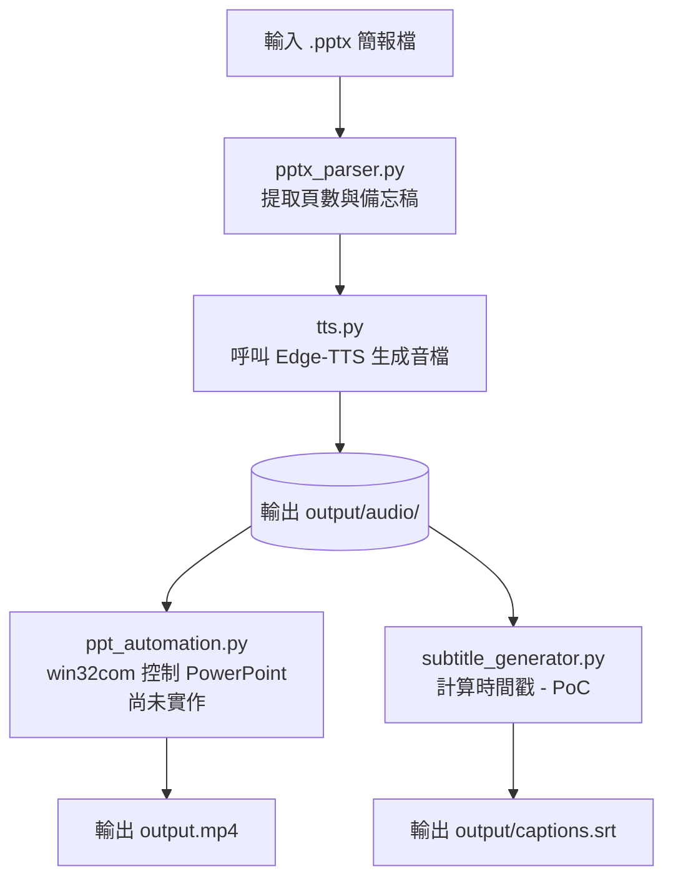

# PPTX Auto Presenter (`pptx2video`)

一個基於 Python 的自動化工具，目標是自動解析 PowerPoint 簡報檔（`.pptx`）的頁數與備忘稿內容，並透過 **Edge-TTS** 生成語音，後續再朝向 PowerPoint 匯出帶配音的 MP4 影片與 SRT 字幕的流程前進。

---

## 🚀 快速開始（Windows）

以下步驟適合在 Windows PowerShell 中從 GitHub 下載這個專案後直接開始使用。

### 1. 下載專案

```powershell
git clone https://github.com/<your-username>/pptx2video.git
cd pptx2video
```

### 2. 建立虛擬環境

```powershell
py -3 -m venv .venv
```

### 3. 啟動虛擬環境

```powershell
.\.venv\Scripts\Activate.ps1
```

若 PowerShell 擋下執行腳本，可先執行：

```powershell
Set-ExecutionPolicy -Scope CurrentUser RemoteSigned
```

### 4. 安裝依賴套件

```powershell
python -m pip install --upgrade pip
pip install -r requirements.txt
```

> `pywin32` 只會在 Windows 環境安裝（`requirements.txt` 已用 `sys_platform == "win32"` 標記），在其他作業系統上執行 `pip install` 會自動跳過它。

### 5. 生成範例簡報（可選）

```powershell
python examples/create_sample_pptx.py
```

### 6. 執行解析流程

```powershell
python src/main.py examples/sample_test.pptx --output output/slides.json
```

或使用更像套件的方式：

```powershell
python -m pptx2video examples/sample_test.pptx --output output/slides.json
```

這會讀取簡報檔，解析每頁的標題與 notes，並輸出 JSON 到 [output/slides.json](output/slides.json)。

### 7. 生成語音（TTS）

```powershell
python -m pptx2video examples/sample_test.pptx --generate-audio --audio-output-dir output/audio --voice "zh-TW-YunJheNeural" --rate "-10%%" --pitch "+0Hz"
```

這會把有 notes 的投影片轉成 MP3，並在 `output/audio/manifest.json` 建立對應的音訊清單。

> `edge-tts` 直接把語音服務回傳的 MP3 位元組寫入檔案，**這個階段不需要安裝 ffmpeg**。ffmpeg 只有在使用 `subtitle_generator.py` 讀取實際音檔時長（PoC 功能）時才會用到。

### 8. 產生字幕（目前為 PoC / 實驗性功能）

不需要額外參數，只要有執行主流程就會自動輸出：

```powershell
python src/main.py examples/sample_test.pptx --subtitles-output output/captions.srt
```

> ⚠️ 字幕生成邏輯目前仍是 Proof of Concept，尚未整合進正式的影片輸出管線，時間軸估算方式未來可能會調整。

---

## 📋 CLI 完整指令與參數說明

### 基本用法

```powershell
python src/main.py <pptx_path> [選項...]
```

或：

```powershell
python -m pptx2video <pptx_path> [選項...]
```

`<pptx_path>`（必填）：輸入的 `.pptx` 簡報檔路徑。

### 參數總表

| 參數 | 預設值 | 說明 |
|---|---|---|
| `--output`, `-o` | `output/slides.json` | 解析結果 JSON 的輸出路徑 |
| `--pretty` | `False`（flag） | 額外把 JSON 結果美化印到終端機（若沒指定 `--output` 也會自動印出） |
| `--indent` | `2` | JSON 輸出的縮排空白數 |
| `--verbose` | `False`（flag） | 印出更詳細的執行進度訊息 |
| `--strict` | `False`（flag） | 若任何一頁沒有 notes，直接中止並回報錯誤（適合用於檢查簡報是否漏寫備忘稿） |
| `--generate-audio` | `False`（flag） | 啟用語音生成，會呼叫 edge-tts 把每頁 notes 轉成 MP3 |
| `--audio-output-dir` | `output/audio` | 生成的 MP3 與 `manifest.json` 存放目錄（需搭配 `--generate-audio` 才有作用） |
| `--voice` | `Microsoft Server Speech Text to Speech Voice (zh-TW, YunJheNeural)` | edge-tts 使用的語音。也可用簡短格式如 `zh-TW-YunJheNeural`，若完整格式在你的環境報錯可改用簡短格式 |
| `--rate` | `-10%` | 語速調整，語音會比原始語速慢 10%；正值加快、負值放慢，例如 `+10%`、`-20%` |
| `--pitch` | `+0Hz` | 音高調整，預設不改變音高 |
| `--subtitles-output` | `output/captions.srt` | 字幕輸出路徑（PoC 功能，每次執行都會自動產生） |

### 使用範例

**只解析、不生成語音，並在終端機印出美化後的 JSON：**

```powershell
python src/main.py examples/sample_test.pptx --pretty
```

**嚴格模式，檢查是否有頁面漏寫 notes：**

```powershell
python src/main.py examples/sample_test.pptx --strict
```

**生成語音，使用加快 10% 的語速：**

```powershell
python src/main.py examples/sample_test.pptx --generate-audio --rate "+10%%"
```

**指定輸出到自訂資料夾，並顯示詳細訊息：**

```powershell
python src/main.py examples/sample_test.pptx --output output/my_slides.json --audio-output-dir output/my_audio --generate-audio --verbose
```

**完整流程（解析 + 語音 + 字幕）：**

```powershell
python src/main.py examples/sample_test.pptx `
  --output output/slides.json `
  --generate-audio `
  --audio-output-dir output/audio `
  --voice "zh-TW-YunJheNeural" `
  --rate "-10%%" `
  --pitch "+0Hz" `
  --subtitles-output output/captions.srt `
  --verbose
```

---

## 📁 專案結構

```text
pptx2video/
├── src/                # 主要程式碼
│   ├── main.py              # CLI 入口與 JSON 輸出
│   ├── pptx_parser.py       # 解析 .pptx 與 notes
│   ├── tts.py                # edge-tts 音訊生成
│   ├── subtitle_generator.py # 字幕生成（PoC）
│   └── __init__.py
├── tests/              # 測試檔案
│   ├── test_pptx_parser.py
│   ├── test_tts_generator.py
│   ├── test_subtitle_generator.py
│   └── test_main_payload.py
├── examples/           # 範例腳本與範例簡報
├── output/             # 輸出檔案（已加入 .gitignore，不進版控）
├── temp/               # 暫存資料夾
├── requirements.txt    # Python 相依套件
├── pyproject.toml      # 專案設定
└── README.md           # 專案說明
```

---

## 🧪 執行測試

跑全部測試：

```powershell
python -m unittest discover -s tests -v
```

只跑單一模組的測試，例如只測 parser：

```powershell
python -m unittest tests.test_pptx_parser -v
```

其他可單獨測試的模組：

```powershell
python -m unittest tests.test_tts_generator -v
python -m unittest tests.test_subtitle_generator -v
python -m unittest tests.test_main_payload -v
```

---

## ✅ 目前已完成的功能

* **解析 `.pptx` 投影片內容**：可讀取投影片編號、標題與 notes。
* **支援長篇備忘稿**：可處理多段落、換行與空白行。
* **支援沒有 notes 的頁面**：封面頁與結束頁也能正常處理，並自動跳過生成音訊。
* **輸出 JSON**：可將解析結果輸出為結構化 JSON，並提供 `subtitle_text`、`has_notes`、`audio_file` 等字幕流程所需欄位。
* **語音生成**：已接入 `edge-tts`，可將 notes 轉成 MP3，並依頁碼命名。
* **字幕生成（PoC）**：可依 notes 與（若可用）實際音檔時長輸出 `.srt`，作為架構驗證，尚未進入正式管線。
* **提供 CLI 介面**：支援本文件列出的所有參數。
* **提供範例與測試**：內建範例簡報生成腳本與單元測試。

## 🚧 後續發展方向

* **PowerPoint 自動化匯出 MP4**：透過 Windows COM 控制 PowerPoint，插入音訊、設定自動播放與轉場時間並匯出影片（`ppt_automation.py`，目前尚未開始實作）。
* **字幕生成正式化**：將目前的 PoC 字幕邏輯整合進正式影片輸出管線，並與音檔時長精確對齊。
* **批次處理與輸出整理**：支援多檔輸入與更完整的輸出目錄管理。

---

## 🧰 需求與環境

- Python 3.9 或以上
- Windows 作業系統（PowerPoint 自動化匯出 MP4 功能需要，目前尚未實作）
- 已安裝 Microsoft PowerPoint（供未來 `ppt_automation.py` 使用 Windows COM 自動化控制 PowerPoint）
- 若要生成語音，需可連線到 Edge-TTS 服務（`speech.platform.bing.com`）
- 若要用 PoC 字幕功能讀取實際音檔時長，需安裝 `ffmpeg` 並加入 PATH（供 `pydub` 解碼 MP3 使用）；純粹生成語音本身不需要 ffmpeg

## 🏗️ 系統架構與資料流



## Current Status

### Completed
- PPTX Parser
- Notes Extraction
- Edge-TTS Audio Generation
- Audio Manifest
- CLI
- Subtitle Generator (Experimental / PoC)

### In Progress
- PowerPoint Automation (Insert Audio / Auto Play / Transition Timing)

### Planned
- Export MP4 using Microsoft PowerPoint

### Experimental Features
The current Subtitle Generator is a Proof of Concept (PoC). It is retained for architecture validation and is not yet part of the official video generation pipeline.
