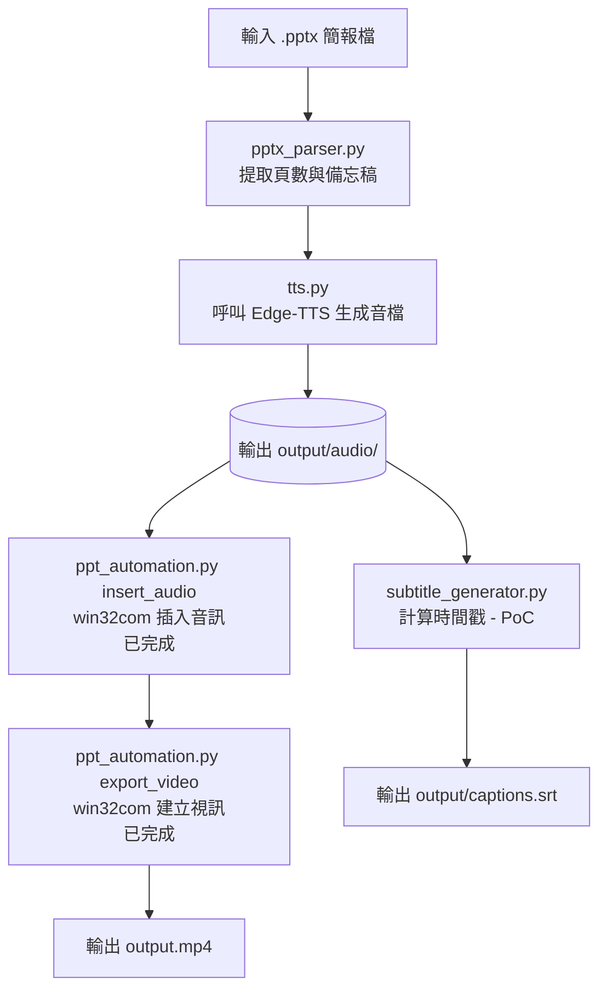

# PPTX Auto Presenter (`pptx2video`)

一個基於 Python 的自動化工具，目標是自動解析 PowerPoint 簡報檔（`.pptx`）的頁數與備忘稿內容，並透過 **Edge-TTS** 生成語音，後續再朝向 PowerPoint 匯出帶配音的 MP4 影片與 SRT 字幕的流程前進。

---

## 🚀 快速開始（Windows）

以下步驟適合在 Windows PowerShell 中從 GitHub 下載這個專案後直接開始使用。

### 1. 下載專案

```powershell
git clone https://github.com/<your-username>/pptx2video.git
cd pptx2video
```

### 2. 建立虛擬環境

```powershell
py -3 -m venv .venv
```

### 3. 啟動虛擬環境

```powershell
.\.venv\Scripts\Activate.ps1
```

若 PowerShell 擋下執行腳本，可先執行：

```powershell
Set-ExecutionPolicy -ExecutionPolicy RemoteSigned -Scope CurrentUser
```

### 4. 安裝依賴套件

```powershell
python -m pip install --upgrade pip
pip install -r requirements.txt
```

> `pywin32` 只會在 Windows 環境安裝（`requirements.txt` 已用 `sys_platform == "win32"` 標記），在其他作業系統上執行 `pip install` 會自動跳過它。

### 5. 生成範例簡報（可選）

```powershell
python examples/create_sample_pptx.py
```

### 6. 執行解析流程

```powershell
python src/main.py examples/sample_test.pptx --output output/slides.json
```

或使用更像套件的方式：

```powershell
python -m pptx2video examples/sample_test.pptx --output output/slides.json
```

這會讀取簡報檔，解析每頁的標題與 notes，並輸出 JSON 到 [output/slides.json](output/slides.json)。

### 7. 生成語音（TTS）

```powershell
python -m pptx2video examples/sample_test.pptx --generate-audio --audio-output-dir output/audio --voice "zh-TW-YunJheNeural" --rate=-10% --pitch="+0Hz"
```

這會把有 notes 的投影片轉成 MP3，並在 `output/audio/manifest.json` 建立對應的音訊清單。

> `edge-tts` 直接把語音服務回傳的 MP3 位元組寫入檔案，**這個階段不需要安裝 ffmpeg**。ffmpeg 只有在使用 `subtitle_generator.py` 讀取實際音檔時長（PoC 功能）時才會用到。

### 8. 產生字幕（目前為 PoC / 實驗性功能）

不需要額外參數，只要有執行主流程就會自動輸出：

```powershell
python src/main.py examples/sample_test.pptx --subtitles-output output/captions.srt
```

> ⚠️ 字幕生成邏輯目前仍是 Proof of Concept，尚未整合進正式的影片輸出管線，時間軸估算方式未來可能會調整。

### 9. 把音訊插入 PPTX（需要 Windows + PowerPoint）

```powershell
python src/main.py examples/sample_test.pptx --insert-audio --audio-output-dir output/audio --pptx-output output/deck_with_audio.pptx --verbose
```

這會透過 `pywin32` 開啟 PowerPoint，把每頁對應的 MP3 插入該投影片，圖示縮小並移到右上角，且盡量在非播放狀態隱藏。沒有音檔的頁面（例如封面/結尾頁）完全不會被更動。

> ⚠️ **重要（實測結論）**：插入後在 PowerPoint 編輯畫面裡，音訊的 Start 設定仍會顯示「按一下時」，用「投影片放映」現場播放時需要多點一下音符圖示才會出聲——這是已知限制，目前尚未解決（詳見下方「已知限制」）。**但這不影響用 PowerPoint「建立視訊」匯出 MP4**：匯出時每頁會自動依照音檔實際長度撥放並切換頁面，不需要額外設定轉場秒數。這個行為依賴 `AnimationSettings.PlaySettings.PlayOnEntry` 這個舊版旗標必須設為 `True`（雖然它在編輯 UI 上看不出效果，但拿掉它會讓匯出的影片完全沒聲音、且每頁變回固定 5 秒）。

### 10. 匯出 MP4（已自動化，需要 Windows + PowerPoint）

> ⚠️ **這一步跟步驟 9 是接續關係，不是各自獨立的兩步驟**：`--insert-audio` 和 `--export-video` 可以在**同一行指令**裡一起下，程式會依序完成「插入音訊 → 匯出影片」。**不要把步驟 9 的指令跑完，再另外跑一次帶 `--insert-audio` 的步驟 10 指令**——那樣會讓插入音訊的動作被多做一次（重新開一次 PowerPoint、重新插一次音訊），純粹浪費時間。下面依你的情境選其中一種指令即可：

**情境 A：第一次跑，插入音訊跟匯出一次到位（跳過步驟 9，直接執行這一行就好）**

```powershell
python src/main.py examples/sample_test.pptx --insert-audio --audio-output-dir output/audio --pptx-output output/deck_with_audio.pptx --export-video --video-output output/deck.mp4 --verbose
```

**情境 B：已經照步驟 9 插好音訊了，只想匯出（不要再加 `--insert-audio`）**

```powershell
python src/main.py output/deck_with_audio.pptx --export-video --video-output output/deck.mp4
```

兩種情境都會自動呼叫 PowerPoint「建立視訊」功能匯出 MP4（預設 720p、不使用錄製時間、沒有音訊的頁面固定顯示 5 秒），並即時印出匯出進度，例如：

```
Exporting video... status: queued
Exporting video... status: in_progress
Exporting video... status: done
Exported video to D:\...\output\deck.mp4 (42.3s)
```

已在真實 Windows + PowerPoint 環境驗證：影片可以正確產生，語音與每頁時長都對齊。

> ⚠️ `Presentation.CreateVideo()` 是非同步 API，匯出時間會依投影片數量與解析度而定，可能長達數十秒到數分鐘。程式會輪詢匯出狀態，並設有逾時保護（預設 600 秒，可用 `--video-timeout` 調整）。

### 11. 一次到底：單一指令完成整個流程

上面 1～10 是拆開一步步介紹，方便逐步理解與除錯；但實際使用時**不需要分開下指令**，所有步驟（解析 → 生成語音 → 輸出 JSON → 生成字幕 → 插入音訊 → 匯出 MP4）都可以寫在同一行指令裡，`main.py` 會依序自動完成：

```powershell
python src/main.py examples/sample_test.pptx `
  --output output/slides.json `
  --generate-audio `
  --audio-output-dir output/audio `
  --voice "zh-TW-YunJheNeural" `
  --rate=-10% `
  --pitch="+0Hz" `
  --subtitles-output output/captions.srt `
  --insert-audio `
  --pptx-output output/deck_with_audio.pptx `
  --export-video `
  --video-output output/deck.mp4 `
  --verbose
```

執行時會依序印出每個階段的進度：

```
Parsing PowerPoint file: ...
Loaded 5 slide(s)
Generating audio 1/3 (slide 2)...
Generating audio 2/3 (slide 3)...
Generating audio 3/3 (slide 4)...
Generated 3 audio file(s) in output/audio
Saved JSON to output\slides.json
Saved subtitles to output\captions.srt
Inserted audio into 3 slide(s); skipped 0. Saved to ...\deck_with_audio.pptx
Exporting video... status: queued
Exporting video... status: in_progress
Exporting video... status: done
Exported video to ...\deck.mp4 (42.3s)
```

**注意事項：**
- 生成語音需要能連上 Edge-TTS 服務（`speech.platform.bing.com`）
- 插入音訊與匯出 MP4 都需要 Windows + 已安裝 PowerPoint + `pywin32`
- 這一行指令裡 PowerPoint 實際上會被開關兩次：`--insert-audio` 用一次、`--export-video` 又用一次（各自獨立完成後就關閉），不是同一個 PowerPoint session 做完兩件事。這不影響結果，只是會多花一點點時間；如果之後有大量批次處理、在意這個開銷，可以再優化成同一個 session 共用（目前尚未實作）。

---

## 📋 CLI 完整指令與參數說明

### 基本用法

```powershell
python src/main.py <pptx_path> [選項...]
```

或：

```powershell
python -m pptx2video <pptx_path> [選項...]
```

`<pptx_path>`（必填）：輸入的 `.pptx` 簡報檔路徑。

### 參數總表

| 參數 | 預設值 | 說明 |
|---|---|---|
| `--output`, `-o` | `output/slides.json` | 解析結果 JSON 的輸出路徑 |
| `--pretty` | `False`（flag） | 額外把 JSON 結果美化印到終端機（若沒指定 `--output` 也會自動印出） |
| `--indent` | `2` | JSON 輸出的縮排空白數 |
| `--verbose` | `False`（flag） | 印出更詳細的執行進度訊息 |
| `--strict` | `False`（flag） | 若任何一頁沒有 notes，直接中止並回報錯誤（適合用於檢查簡報是否漏寫備忘稿） |
| `--generate-audio` | `False`（flag） | 啟用語音生成，會呼叫 edge-tts 把每頁 notes 轉成 MP3 |
| `--audio-output-dir` | `output/audio` | 生成的 MP3 與 `manifest.json` 存放目錄（需搭配 `--generate-audio` 才有作用） |
| `--voice` | `Microsoft Server Speech Text to Speech Voice (zh-TW, YunJheNeural)` | edge-tts 使用的語音。也可用簡短格式如 `zh-TW-YunJheNeural`，若完整格式在你的環境報錯可改用簡短格式 |
| `--rate` | `-10%` | 語速調整，語音會比原始語速慢 10%；正值加快、負值放慢，例如 `+10%`、`-20%`。⚠️ **負值務必用 `--rate=-20%` 等號寫法**，不要用空格分隔的 `--rate "-20%"`（見下方說明） |
| `--pitch` | `+0Hz` | 音高調整，預設不改變音高 |
| `--subtitles-output` | `output/captions.srt` | 字幕輸出路徑（PoC 功能，每次執行都會自動產生） |
| `--insert-audio` | `False`（flag） | 把已生成的音訊插入 PPTX 對應投影片，圖示縮小移到右上角並盡量隱藏。需要 Windows + PowerPoint + pywin32，且需已用 `--generate-audio` 產生過音檔（或指定的 `--audio-output-dir` 底下已有 `manifest.json`） |
| `--pptx-output` | 覆蓋輸入檔 | 搭配 `--insert-audio` 使用，指定插入音訊後另存的 PPTX 路徑；未指定則直接覆蓋原始輸入檔 |
| `--export-video` | `False`（flag） | 用 PowerPoint「建立視訊」功能匯出 MP4。需要 Windows + PowerPoint + pywin32。若同時有 `--insert-audio`，會匯出剛插入音訊的那份；否則直接匯出 `pptx_path`（或 `--pptx-output` 指定的檔案） |
| `--video-output` | PPTX 路徑改副檔名為 `.mp4` | 搭配 `--export-video` 使用，指定匯出的 MP4 路徑 |
| `--video-resolution` | `720` | 匯出解析度（垂直像素），對應 PowerPoint 預設選項：`480`（標準）、`720`（HD）、`1080`（Full HD）、`2160`（4K）；寬度會依投影片比例自動計算 |
| `--video-fps` | `30` | 匯出影片的每秒畫面格數 |
| `--video-quality` | `85` | 編碼品質，0–100（PowerPoint 官方預設值就是 85） |
| `--video-default-duration` | `5.0` | 沒有錄製時間、也沒有自動播放音訊的頁面（例如封面頁）要停留幾秒，對應 PowerPoint 匯出視窗的「每張投影片所用秒數」 |
| `--video-use-recorded-timings` | `False`（flag） | 是否改用簡報錄製的時間/旁白，而不是 `--video-default-duration` / 音訊時長驅動的時間。預設關閉，對應 PowerPoint「不使用錄製的時間和旁白」選項 |
| `--video-timeout` | `600`（秒） | 等待 PowerPoint 匯出完成的逾時秒數，投影片數量多或解析度高時建議調大 |

> ⚠️ **關於 `--rate` 負值的一個 Python argparse 陷阱**：像 `--rate "-10%"` 這種用空格分隔、值又以 `-` 開頭的寫法，會被 `argparse` 誤判成另一個選項旗標而報錯 `expected one argument`（`--pitch` 因為預設是 `+0Hz`，以 `+` 開頭，不受影響）。**負值請一律用等號寫法**，例如：`--rate=-20%`（等號連在一起、不要空格）。加速（正值）用空格或等號都可以，例如 `--rate "+10%"` 或 `--rate=+10%` 皆正常。

### 使用範例

**只解析、不生成語音，並在終端機印出美化後的 JSON：**

```powershell
python src/main.py examples/sample_test.pptx --pretty
```

**嚴格模式，檢查是否有頁面漏寫 notes：**

```powershell
python src/main.py examples/sample_test.pptx --strict
```

**生成語音，使用加快 10% 的語速：**

```powershell
python src/main.py examples/sample_test.pptx --generate-audio --rate "+10%"
```

**指定輸出到自訂資料夾，並顯示詳細訊息：**

```powershell
python src/main.py examples/sample_test.pptx --output output/my_slides.json --audio-output-dir output/my_audio --generate-audio --verbose
```

**只把已生成的音訊插入 PPTX，另存新檔，不覆蓋原始檔案：**

```powershell
python src/main.py examples/sample_test.pptx --insert-audio --audio-output-dir output/audio --pptx-output output/deck_with_audio.pptx
```

**只匯出 MP4（假設已經有插好音訊的 pptx），用 1080p 匯出：**

```powershell
python src/main.py output/deck_with_audio.pptx --export-video --video-output output/deck.mp4 --video-resolution 1080
```

**完整流程（解析 + 語音 + 字幕 + 插入音訊 + 匯出 MP4，等同於上方「11. 一次到底」的單一指令）：**

```powershell
python src/main.py examples/sample_test.pptx `
  --output output/slides.json `
  --generate-audio `
  --audio-output-dir output/audio `
  --voice "zh-TW-YunJheNeural" `
  --rate=-10% `
  --pitch="+0Hz" `
  --subtitles-output output/captions.srt `
  --insert-audio `
  --pptx-output output/deck_with_audio.pptx `
  --export-video `
  --video-output output/deck.mp4 `
  --verbose
```

---

## 📁 專案結構

```text
pptx2video/
├── src/                # 主要程式碼
│   ├── main.py              # CLI 入口與 JSON 輸出
│   ├── pptx_parser.py       # 解析 .pptx 與 notes
│   ├── tts.py                # edge-tts 音訊生成
│   ├── subtitle_generator.py # 字幕生成（PoC）
│   ├── ppt_automation.py     # PowerPoint COM 自動化：插入音訊
│   └── __init__.py
├── tests/              # 測試檔案
│   ├── test_pptx_parser.py
│   ├── test_tts_generator.py
│   ├── test_subtitle_generator.py
│   ├── test_ppt_automation.py
│   └── test_main_payload.py
├── examples/           # 範例腳本與範例簡報
├── output/             # 輸出檔案（已加入 .gitignore，不進版控）
├── temp/               # 暫存資料夾
├── requirements.txt    # Python 相依套件
├── pyproject.toml      # 專案設定
└── README.md           # 專案說明
```

---

## 🧪 執行測試

跑全部測試：

```powershell
python -m unittest discover -s tests -v
```

只跑單一模組的測試，例如只測 parser：

```powershell
python -m unittest tests.test_pptx_parser -v
```

其他可單獨測試的模組：

```powershell
python -m unittest tests.test_tts_generator -v
python -m unittest tests.test_subtitle_generator -v
python -m unittest tests.test_ppt_automation -v
python -m unittest tests.test_main_payload -v
```

> `test_ppt_automation.py` 用假的 COM 物件模擬 PowerPoint，不需要真的安裝 PowerPoint 也能在任何作業系統跑，但這不能取代在真實 Windows + PowerPoint 環境的實測。

---

## ✅ 目前已完成的功能

* **解析 `.pptx` 投影片內容**：可讀取投影片編號、標題與 notes。
* **支援長篇備忘稿**：可處理多段落、換行與空白行。
* **支援沒有 notes 的頁面**：封面頁與結束頁也能正常處理，並自動跳過生成音訊。
* **輸出 JSON**：可將解析結果輸出為結構化 JSON，並提供 `subtitle_text`、`has_notes`、`audio_file` 等字幕流程所需欄位。
* **語音生成**：已接入 `edge-tts`，可將 notes 轉成 MP3，並依頁碼命名，執行時會即時顯示生成進度（第幾個/共幾個）。
* **字幕生成（PoC）**：可依 notes 與（若可用）實際音檔時長輸出 `.srt`，作為架構驗證，尚未進入正式管線。
* **PowerPoint 音訊插入**：透過 `pywin32` COM 自動化，把生成的 MP3 插入對應投影片，圖示縮小並移到右上角、盡量隱藏，且已驗證搭配 PowerPoint「建立視訊」匯出 MP4 時能正確自動播放並依音檔長度切換頁面。沒有音檔的頁面完全不受影響。
* **MP4 匯出自動化**：透過 `Presentation.CreateVideo()` COM API 自動觸發 PowerPoint「建立視訊」，輪詢非同步匯出狀態直到完成，並在回報完成後額外檢查輸出檔案確實存在。**已在真實 Windows + PowerPoint 環境驗證：影片正確產生，語音與每頁時長皆正確對齊。** 解析度、FPS、畫質、逾時秒數等皆可透過 CLI 參數調整。
* **提供 CLI 介面**：支援本文件列出的所有參數。
* **提供範例與測試**：內建範例簡報生成腳本與單元測試。

## ⚠️ 已知限制

* **PowerPoint 編輯畫面 / 現場放映模式仍需點擊音符圖示才會播放**：目前插入音訊後，PowerPoint 編輯 UI 顯示的 Start 設定固定是「按一下時」，用「投影片放映」模式現場簡報時，需要多點一下音符圖示音檔才會出聲。這是透過 COM 的 `AddMediaObject2` 插入媒體時的行為，跟手動用 UI 插入不同；曾嘗試透過 `slide.TimeLine.MainSequence` 修改動畫觸發方式，但在實測環境中不穩定（找不到對應效果），因此**目前刻意不處理這個情境**，優先確保 MP4 匯出正確無誤。若之後有現場放映（非匯出影片）的需求，需要再回來解決。
* **`PlayOnEntry` 旗標的必要性尚未完全理解原理，僅為實測結論**：拿掉這個舊版旗標會讓匯出的 MP4 完全沒聲音、且每頁變回固定 5 秒，即使編輯 UI 上完全看不出差異。目前程式碼會固定設定這個旗標，但底層原理（為何匯出引擎依賴一個 UI 不可見的旗標）尚未查證，如果之後 PowerPoint 版本更新導致行為改變，這裡可能需要重新測試。
* **`CreateVideoStatus` 的狀態列舉值是依 Microsoft 官方文件假設，未逐一比對所有 PowerPoint 版本**：程式碼加了安全網（回報完成後仍會檢查輸出檔案是否存在、非空）來降低這個風險，但如果之後在不同 PowerPoint 版本上遇到匯出邏輯誤判，這是優先排查的地方。

## 🚧 後續發展方向

* **現場放映自動播放**：解決上面「已知限制」提到的點擊問題，如果未來有現場簡報（非僅匯出影片）的需求。
* **字幕生成正式化**：將目前的 PoC 字幕邏輯整合進正式影片輸出管線，並與音檔時長精確對齊。
* **批次處理與輸出整理**：支援多檔輸入與更完整的輸出目錄管理。
* **`--insert-audio` 匯出進度提示**：目前只有 `--generate-audio` 和 `--export-video` 有即時進度顯示，插入音訊的迴圈還沒有（投影片數量多時，中途無法得知進度）。

---

## 🧰 需求與環境

- Python 3.9 或以上
- Windows 作業系統（音訊插入與 MP4 匯出功能需要）
- 已安裝 Microsoft PowerPoint（供 `ppt_automation.py` 使用 Windows COM 自動化插入音訊、匯出 MP4）
- 若要生成語音，需可連線到 Edge-TTS 服務（`speech.platform.bing.com`）
- 若要用 PoC 字幕功能讀取實際音檔時長，需安裝 `ffmpeg` 並加入 PATH（供 `pydub` 解碼 MP3 使用）；純粹生成語音本身不需要 ffmpeg

## 🏗️ 系統架構與資料流



## Current Status

### Completed
- PPTX Parser
- Notes Extraction
- Edge-TTS Audio Generation (with real-time progress reporting)
- Audio Manifest
- CLI
- Subtitle Generator (Experimental / PoC)
- PowerPoint Audio Insertion (`ppt_automation.py: insert_audio`) - verified working with PowerPoint's video export
- MP4 Export Automation (`ppt_automation.py: export_video`) - verified end-to-end on real Windows + PowerPoint: video plays correctly, per-slide timing matches audio length

### Planned
- Live-presentation auto-play (currently still requires a click; not needed for video export)
- Progress reporting for `--insert-audio` (currently only `--generate-audio` and `--export-video` report progress)
- Formalizing the subtitle generator into the main pipeline

### Known Limitations
- Inserted audio still shows "On Click" in the PowerPoint editor UI and requires a click during live Slide Show playback. This does not affect video export, which was verified to auto-play and time each slide correctly.
- The legacy `PlayOnEntry` flag was empirically found to be required for correct video export (audio + duration), even though it has no visible effect in the editor UI. The underlying reason is not fully understood; revisit if a future PowerPoint version changes this behavior.
- `CreateVideoStatus`'s enum values are assumed from Microsoft's documented `PpMediaTaskStatus` reference, not verified against every PowerPoint COM version. A safety-net file-existence check after a reported "done" status mitigates this risk.

### Experimental Features
The current Subtitle Generator is a Proof of Concept (PoC). It is retained for architecture validation and is not yet part of the official video generation pipeline.
