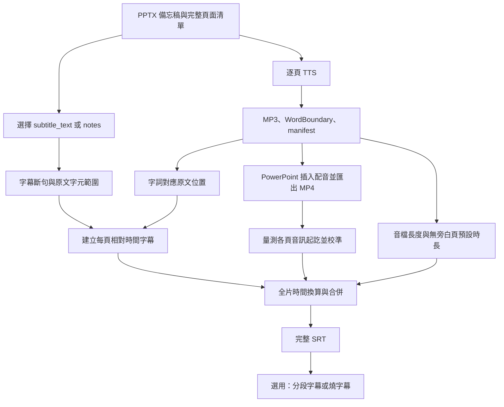

# 字幕處理機制與可靠度改善評估報告

- 撰寫日期：2026-09-30
- 範圍：講稿、Edge-TTS WordBoundary、逐頁字幕、影片時間定位、SRT 合併與後續燒字幕。
- 依據：本次對話中閱讀的專案 Markdown 文件，以及實際核對的 `subtitle_pipeline.py`、`subtitle_alignment.py`、`audio_position_locator.py`、`tts.py`、`main.py`、`regenerate_srt_from_export.py` 等程式碼。
- 文件版本參考：CHANGELOG 最新記錄為 v0.10.0；不代表本次已核對 Git tag、重新執行測試或重現所有歷史案例。
- 本報告提出的改善均為建議，尚未實作。歷史實測結果、程式現行行為、建議驗收門檻分別標示，不將預期效益視為已證實成果。

## 1. 評估結論

目前架構已具備完整的「原始講稿 → 頁內字幕 → 全片時間軸 → SRT」處理流程，並针对真實長影片、TTS 漏講、重複詞誤配、字幕重疊等問題加入修正。

核心優點是保留原始講稿作為文字依據，使用 TTS 字詞時間建立頁內對齊，再以匯出影片的音軌量測頁面位置。這讓文字內容、字幕斷句與影片時間軸可以分開處理，也允許不重生配音就重建字幕。

目前較大的可靠度缺口，是「演算法有產出」不等於「產出已被證明可靠」：輸入可能來自不同生成批次，文字候選可能高度模糊，音訊相關峰值可能誤配，退回預測後仍可成功寫出 SRT，而最終檔案尚缺完整的全片品質判定。

建議第一階段先做資料一致性檢查、全片 SRT 驗證與逐頁品質報告；第二階段改善文字與音訊匹配的模糊情況處理；第三階段研究全域比例偏差根因與閱讀品質。先建立可觀察、可量測的品質基準，再判斷較複雜演算法是否確實改善結果。

## 2. 目前的資料與時間模型

### 2.1 輸入與中間產物

| 資料 | 作用 |
|---|---|
| PPTX 備忘稿 `notes` | 送入 TTS 的講稿來源 |
| `slides.json` | 完整投影片清單，包含頁碼、講稿與可選 `subtitle_text` |
| 每頁 MP3 | 該頁實際生成的旁白 |
| 每頁 `wordboundaries.json` | 字詞文字、相對於該頁音訊的開始時間與持續時間 |
| `manifest.json` | 以頁碼連結 MP3 與 WordBoundary 檔案；另記錄生成相關資訊與漏講警告 |
| 匯出 MP4 | PowerPoint 實際生成的影片，供音軌定位 |
| 完整 SRT | 全片絕對時間軸上的字幕 |

`slides.json` 必須保留沒有旁白的頁面。只有音訊清單不足以還原所有頁面的預測時間軸。

### 2.2 三種 offset 不可混為一談

| 類型 | 單位 | 意義 |
|---|---|---|
| 原文位置 | 字元索引 | 字詞或字幕片段在講稿中的起訖位置 |
| 字詞音訊位置 | 秒 | WordBoundary 相對於該頁 MP3 的時間 |
| 頁面音訊位置 | 秒 | 該頁 MP3 在全片音軌中的起點 |

WordBoundary 沒有提供可直接套用於原始講稿的字元位置，因此專案需要自行搜尋發音文字在講稿中的位置。重複詞問題發生在這一層，不是直接改錯了 TTS 回傳的秒數。

此外，音訊定位得到的是嵌入音訊的時間位置，不是直接分析畫面取得的換頁影格。一般簡報可能兩者接近，但不能對有轉場或延遲播放的所有簡報宣稱完全相同。

## 3. 目前完整字幕流程



### 3.1 取得頁內字詞時間

TTS 串流同時提供音訊與字詞事件。程式以每秒 10,000,000 ticks 換算為秒，保存 `text`、`offset_seconds`、`duration_seconds`。

一個事件可能包含多個中文字，例如「系統的」，並非固定一字一事件。字幕的斷句邊界與 TTS 的事件邊界因此不一定相同。

### 3.2 決定字幕文字與斷句

`_build_slide_captions()` 優先使用非空 `subtitle_text`，否則使用 `notes`。

斷句依段落、分層標點、顯示寬度與 jieba 詞界處理，必要時透過動態規劃平衡行寬。預設顯示寬度為 36，約等於 18 個全形字。段落是硬邊界，不跨段合併。

片段保留 `source_start_offset` 與 `source_end_offset`，讓後續對齊仍能追溯原文，即使顯示文字已清理空白或句尾標點。

`subtitle_text` 的設計讓字幕排版可獨立調整。若只依既定規則加入標點與換行、沒有改變發音文字，可以沿用音訊與 WordBoundary；若修改了實際講述內容，就不能假設原有時間資料仍適用。現有 `verify_notes_preprocessing.py` 與 `apply_subtitle_text.py` 分別支援預處理檢查與合法 JSON 寫入，但不應把它們視為所有主流程已強制執行的一致性防線。

### 3.3 字詞對應原文

`_match_word_boundaries()` 按事件順序維護文字游標。找到事件文字的位置後，附加其原文字元範圍，再把游標推到該範圍末端。

搜尋策略為：

1. 在有限搜尋窗內精確搜尋。
2. 有多個候選且有後續事件時，執行重複詞消歧。
3. 窗內沒有精確候選時，嘗試往後不限範圍精確搜尋。
4. 再嘗試窗內不分大小寫搜尋。
5. 找不到時跳過該事件並記錄警告。

現行候選消歧只套用於有限窗內的多個精確候選；不是每種退回搜尋都進行完整候選評分。

### 3.4 由事件建立字幕相對時間

對每個字幕片段，收集原文字元範圍與其有交集的已匹配事件：

```text
頁內開始 = 對應事件最早的 offset_seconds
頁內結束 = 對應事件最晚的 offset_seconds + duration_seconds
```

無事件可用時，使用周邊匹配資訊推估並警告。推估時間不具備直接匹配的同等證據。

同頁收尾處理包含：

- 若有較長空隙，將前句延長到後句開始前 0.15 秒。
- 若前句結束超過後句開始，將前句結束收斂，並以自身開始時間為下限。
- 最後一句不為填補跨頁空隙而延伸至下一頁。

這能避免已知的相鄰字幕重疊案例，但下限保護可能留下零時長字幕；沒有負時長不代表一定可見。也不能直接推論所有退回情況與跨頁合併結果都已通過全片驗證。

### 3.5 預測模式：累加每頁時長

`generate_srt_for_deck()` 用前面所有頁面的時長總和作為本頁 offset：

```text
P_i = 前面各頁 duration_seconds 的總和
全片開始 = P_i + 頁內開始
全片結束 = P_i + 頁內結束
```

| 頁面資料情況 | 預測時長 | 字幕處理 |
|---|---|---|
| 有 MP3 與 WordBoundary | pydub 量測的 MP3 完整長度 | 建立字幕 |
| manifest 無該頁項目 | `default_slide_duration`，預設 5 秒 | 無字幕 |
| MP3 可讀、WordBoundary 缺失或損毀 | MP3 完整長度 | 略過字幕並警告 |
| MP3 缺失或不可讀 | 退回預設時長並警告 | 其他資料若可用，仍可能建立字幕，但定位可靠度降低 |

時長不是最後一個 WordBoundary 的結束時間，MP3 尾端靜音也算入。

例如封面 5 秒、第二頁音訊 60 秒、第三頁無旁白 5 秒，則第四頁的預測 offset 為 70 秒。第四頁頁內 2～4 秒的字幕變成全片 72～74 秒。

「空白頁」在這裡指沒有音訊清單項目的頁面，不是以畫面是否空白判斷。即使畫面有標題或圖片，只要無旁白，一樣需保留停留時間。

### 3.6 實測模式：從 MP4 定位音訊

`locate_slide_start_and_end_times()` 抽出影片音軌，與各頁 MP3 做互相關比對。

- 以累加的預測位置作為搜尋中心，於有限時間窗中搜尋。
- 預設使用開頭 8 秒的 anchor 定位起點；長度不足時使用可用音訊。
- 足夠長的音檔再以末端 8 秒 anchor 定位尾端，換算音訊終點。
- 不足以形成兩個獨立 anchor 的短音檔，終點退回「量測起點＋原始長度」。
- 起點與終點各自乘上 `global_scale_correction`。

設量測起訖為 `S_i`、`E_i`，係數為 `k`，原始 MP3 長度為 `D_i`：

```text
S'_i = k × S_i
E'_i = k × E_i
r_i = (E'_i − S'_i) / D_i

字幕全片開始 = S'_i + r_i × 字幕頁內開始
字幕全片結束 = S'_i + r_i × 字幕頁內結束
```

`k` 已透過校正起訖影響 `r_i`，後續不能再對最終字幕時間重複乘一次。短音檔的終點退回估算也應與雙 anchor 實測分開標示，兩者證據強度不同。

程式仍保留以下退回策略：

1. 本頁有起訖：由本頁直接計算比例。
2. 有起點但無終點：由下一個已量測頁面的實際／預測間距推算比例。
3. 無法推算本頁比例：用其他頁面的平均比例；全無資料則為 1.0。
4. 本頁沒有量測起點：回到從頭累加的預測位置，比例為 1.0，並警告。

最後一種目前不是從最近可靠頁面重新錨定，因此可能承受先前累積的預測偏差。

### 3.7 實測模式中的無旁白頁

無旁白頁没有音訊模板，無法透過此方法直接測出自己的起點。其預設時長仍用於搜尋中心與退回時間軸的計算。

若下一個配音頁成功實測，其絕對起點已包含前面無旁白頁、轉場與其他間隔，不需再額外加一次 5 秒。若下一頁定位失敗，無旁白頁預設時長是否正確就會影響退回位置。

主流程的 `--video-default-duration` 與重建工具的 `--default-slide-duration` 應一致；實測模式也不能完全忽略這項設定。

### 3.8 合併、重建與燒字幕

程式在記憶體中合併各頁字幕資料，最後呼叫 `format_srt()`，產生連續編號與毫秒時間戳；不需先寫每頁 SRT 再拼接。無旁白頁不生成空字幕項目，只留下時間空隙。

目前使用者的流程為：

1. 完整生成配音、含音訊 PPTX、MP4 與字幕。
2. `regenerate_srt_from_export.py` 使用原始文字、音訊與 WordBoundary 重建字幕，套用 `1.001221`。
3. `burn_subtitles.py` 依最終 SRT 畫入字幕，不再推算逐頁 offset。

重建工具不是讀舊 SRT 再把時間乘倍率，而是重新量測、對齊與合併。燒字幕也不會修復已經錯位的 SRT。

## 4. 歷史問題與現行設計理由

### 4.1 長影片的累加時間漂移

**問題：** 早期直接累加 MP3 長度，在短簡報看似足夠；文件記錄一份約 2 小時 40 分鐘簡報，預測與實際影片位置最大偏差達 9.09 秒。

**處理：** 增加匯出後音訊定位，讓字幕採用每頁實際音訊位置。

**理由：** PowerPoint 實際輸出時間不能完全由原始音檔長度推導。實際量測可避免把每頁誤差一路累加。

**限制：** 定位本身仍會有誤差，需要品質評估；單頁失敗時仍可能退回預測。

### 4.2 整段音訊比對與頁內時間比例

**問題：** 使用數分鐘整段音訊當模板，對微小時間尺度差異敏感；只校正頁面起點仍可能留下頁內偏差。以「下一頁起點」推算本頁長度，又會混入頁間空隙。

**處理：** 改用短 anchor，並分別量測本頁音訊起點、終點，再建立頁內時間映射。

**理由：** 起訖均由本頁自己的音訊提供證據，減少依赖下一頁的影響。

**歷史假說的修正：** 早期註解曾將現象歸因於 PowerPoint 加速音訊。CHANGELOG 後續記錄已推翻該案例的這項假說，指出全域量測偏差才是需校準的部分。部分程式註解仍沿用舊說法，不應視為已證實的通用物理原因。頁內比例映射是現行演算法行為，根因判斷則仍需獨立證據。

### 4.3 全域比例偏差與 `1.001221`

**問題：** 即使改用量測，歷史案例仍有隨全片時間增長的偏差，單靠內部抽樣比對曾顯得準確，卻與人工播放核對不一致。

**處理：** 對量測起訖乘上全域係數，預設為 1.0，透過人工觀測或自動估算取得環境適用值。

**文件記錄的實測：**

| 案例 | 係數 | 校正後 RMS | 最大殘差 |
|---|---:|---:|---:|
| 約 2 小時 40 分鐘簡報 | 1.00121 | 0.27 秒 | 0.53 秒 |
| 不同機器、18 頁、18 個觀測點 | 1.001221 | 0.170 秒 | 0.312 秒 |

**限制：** 兩次相近不代表普遍成立。確切根因尚未定位，不能把此係數當所有影片的固定答案，也不能將校準樣本上的誤差當作獨立驗證集誤差。

### 4.4 TTS 靜默漏講

**問題：** Edge-TTS 曾未報錯卻漏掉大段講稿。一般字幕匹配警告不足以清楚指出實際語音缺漏。

**處理：** `find_suspected_dropped_narration()` 比較相鄰匹配事件間的原文字數與音訊時間，以該頁平均語速估算合理時長。預設至少跳過 15 字，且實際間隔小於預期的 30% 時回報疑似漏講。

**理由：** 用該頁自己的語速作基準，並排除小量標點空白差異，可聚焦明顯異常。

**限制：** 這是間接偵測，依賴文字對齊正確。短漏講可能低於門檻；頁首、頁尾或整頁缺漏不能只靠「相鄰已匹配事件間的空隙」完整覆蓋。警告不是漏講的最終證明，沒有警告也不是完整性的保證。

### 4.5 重複詞導致原文 offset 錯配

**第一個案例：** 講稿兩次出現 `Flash`，TTS 跳過包含第一次出現的一段內容。舊邏輯取游標後第一個同詞，將第二次實際發音的時間配給第一次文字，導致漏講範圍被切碎、後续錯位。

**第一輪處理：** 有多個候選時，向後看 3 個非空事件。逐一尋找後續字詞，累計跳過字元數作為 continuation cost，偏好接續較連貫的候選。

**第二個案例：** 第 13 頁含「四個階段：Input，也就是輸入」與「第一個階段，Input，也就是輸入」等近似句。僅一兩個標點的成本差異讓較遠候選勝出，游標跳過約 135 字，產生超過 700 個後續警告。

**最終處理：** 找出最低 continuation cost，將成本在最低值加 10 字元內的候選視為接近，再選離游標最近的位置。10 是成本容許差距，不是候選距離上限，也不是秒數。

**理由：** 真實漏講的後續接續差異通常較大；標點差異較小，不應為此跳過一整段正常文字。

**證據與限制：** CHANGELOG 記錄正常與真實漏講資料回歸驗證通過。這仍是有限前瞻的啟發式策略，遇到長段完全重複、詞形轉換或其他未見資料，不保證唯一正解。

### 4.6 相鄰字幕重疊與燒字幕「消失」

**問題：** 字幕切點落在同一 WordBoundary 事件內，前後兩句都取得完整事件時間而重疊。libass 碰撞迴避把其中一句推到固定黑條之外，白字在淺色背景難以辨識。

**處理：** 在頁內對齊收尾時，將前句結束收斂至後句開始，避免負時長。

**文件實測：** 同一完整簡報 3,360 條字幕，舊版 6 處重疊，新版 0 處。

**限制：** 收斂解決衝突，不代表事件內每個字的切換時間已精確；嚴重情況可能出現零時長。jieba 切錯「廣泛」等詞是另一個文字排版問題，不能靠時間收斂修好。

### 4.7 資料重用、測試隔離與編碼

- 單獨重建字幕曾未讀取既有 manifest，造成空 SRT；已補上既有資料解析路徑。
- 部分頁面重生會合併保留其他頁 manifest，避免重跑整份 TTS，但也增加不同批次資料共存的管理需求。
- 測試曾誤讀工作目錄中的真實 `output/audio`；已改用隔離暫存目錄。
- Windows 管線輸出中文曾因 cp1252 崩潰；以子行程 UTF-8 輸出與父行程明確 UTF-8 解碼處理。

這些問題說明，可靠度不只取決於對齊演算法，也取決於資料來源、檔案生命週期與執行環境。

## 5. 改善方案與預期效益

### 5.1 資料一致性與來源追溯：優先實作

**方式：** 擴充具版本號的 manifest／旁路 metadata，記錄每頁 TTS 原稿 SHA-256、音訊與 WordBoundary 檔案雜湊、生成參數、生成識別碼。記錄字幕使用的文字版本、影片雜湊與工具版本。

讀取時分別驗證：

- 檔案完整性：內容是否與記錄一致。
- 語意相容性：字幕文字是否只包含允許的排版變更。
- 生成關聯：音訊與時間資料是否由同一次操作產生。

僅對現有檔案事後計算雜湊不能證明它們原本配套，舊資料應標示「來源未驗證」。應沿用既有文字預處理驗證規則，不能任意刪除所有標點再比較，避免忽略小數點等有意義差異。

**預期效益：** 阻止已知的混批次、過期講稿、半套更新進入字幕流程。

**代價：** 舊資料相容處理、metadata 維護、長影片雜湊 I/O 成本。雜湊證明一致性，不證明語音內容正確。

**量測：** 對刻意交換 MP3／WordBoundary、改講稿、截斷檔案等故障注入，評估攔截率與正常資料誤阻率。

### 5.2 對齊診斷與模糊區段處理

**方式：** 先保留現行策略，記錄候選數、各候選成本、距離、游標跳躍、後續失配數與頁面匹配覆蓋率。第一版稱為「品質旗標」，不要把未校準分數包裝成機率。

僅在模糊區段評估自適應前瞻，例如由 3 個事件逐步增加；或用有界 beam search／動態規劃保留少量單調候選路徑，納入漏講、插入、重複詞與文字距離成本。可研究由後續唯一片語重新錨定，並對前一模糊區段有限回溯。

時間與頁面語速可作輔助訊號，但不宜當硬限制，否則會錯誤拒絕真實停頓或語速變化。前瞻越長也不一定越好，TTS 漏講與文字正規化可能使長前瞻更難匹配。

**預期效益：** 減少一次誤選導致的連鎖錯位，並使無法判斷的區段可供人工檢查。

**代價：** 計算量、參數與維護複雜度增加；應保留舊演算法作比較基準，避免為少數案例破壞一般資料。

**量測：** 人工標註的事件字元範圍準確率、每千事件誤配數、首次誤配後連鎖錯誤長度，以及模糊警告的精確率／召回率。

### 5.3 全片 SRT 驗證與品質報告：優先實作

**方式：** 在頁內對齊、全片合併與毫秒格式化後分層驗證。內部保留頁碼與證據來源，最後輸出純 SRT，另存 JSON 報告。

硬性不變條件包含開始非負、結束晚於開始、全片順序合理、單行字幕政策下不重疊，以及不超出影片範圍（容許明確定義的量測／取整誤差）。閱讀品質另檢查顯示時長、閱讀速度與行寬，不能與格式錯誤混成同一等級。

發現衝突時優先回查對齊來源；不要一律裁短，避免把錯誤轉成看不到的字幕。零時長需明確處置，可重新對齊、適當合併或阻止正式燒錄，不能靜默移除而漏字。

**預期效益：** 攔截局部修正之後仍存在的全片問題，尤其跨頁重疊與零時長。

**量測：** 無效 cue 數、跨頁重疊數、取整後零時長數、超界數、推估 cue 比例、退回預測頁數。通過格式檢查仍不等於語意時間正確。

### 5.4 音訊定位品質與多錨點交叉驗證

**方式：** 評估正規化相關峰值、最佳峰與排除鄰近峰後的次佳峰差距、是否貼近搜尋邊界、anchor 有效訊號量，以及起訖比例是否異常。

低可信度頁面可採用內部有聲區段或多個 anchor，記錄其相對於原 MP3 的位置，再估計 `影片位置 = a + b × 原始音訊位置`。使用穩健估計排除離群 anchor，並以未參與擬合的 anchor 驗證。必要時有限擴大搜尋窗，不能無限制搜尋整片後直接相信最大峰。

**預期效益：** 識別安靜片段、重複音訊、搜尋範圍不足所造成的誤定位。

**代價：** 更多相關運算與門檻調校；分數在不同音訊內容下不一定可直接比較。多錨點共用相同解碼路徑，仍可能共享系統性偏差。

**量測：** 對獨立標註時間的絕對誤差 P50／P95／最大值、錯峰率、低品質案例攔截率與新增執行時間。

### 5.5 校準紀錄與偏差根因研究

**方式：** 保存係數、來源 MP4、觀測點、樣本取得方法、擬合殘差與適用環境。CLI 明確覆寫優先；影片更換後標示需重新驗證，而非靜默沿用。

研究時分離校準與驗證資料，涵蓋不同影片長度、不同配音、不同 PowerPoint 環境與解析度。記錄解碼樣本數、取樣率、媒體時間戳與相關位移換算，使用已知插入位置的受控訊號及獨立播放時間核對，追查誤差來自哪個環節。

**預期效益：** 避免漏帶係數與重複校正，並判斷是否能消除經驗修正。不能預先承諾根因修復後所有環境都不需校準。

**量測：** 保留驗證集上的時間誤差、誤差隨時間的斜率、跨影片係數變異，以及來源不符的校準設定攔截率。

### 5.6 漏講偵測擴充

**方式：** 除相鄰事件空隙外，增加頁首／頁尾未覆蓋內容、整頁覆蓋率、空事件串流與異常音訊時長检查。將「文字匹配失敗」和「疑似語音缺漏」分開標示。

必要時可研究僅對高風險片段進行第二種獨立語音核對；即使使用 ASR，也只作輔助告警，不取代原始講稿或自動改字幕。數字、英文縮寫、正常發音正規化都需納入誤判測試。

**預期效益：** 補足目前偏重頁面中段大段漏講的覆蓋缺口。

**量測：** 按漏講長度與位置分組的召回率、每小時誤報數、需人工覆聽的分鐘數。獨立語音核對另有成本、隱私與辨識誤差取捨，屬後續選項。

### 5.7 安全寫入與階段間品質關卡

**方式：** 每頁音訊與 WordBoundary 先寫暫存產物，驗證後才更新 manifest；多檔更新使用生成識別碼與最後提交標記，避免把單檔原子替換誤當成多檔交易。SRT 與報告驗證完成後再替換正式輸出，失敗時保留上一份有效結果。

提供「可預覽但有警告」與「可正式燒錄」兩種品質狀態。硬性資料不一致應阻擋，啟發式低可信度則列出可覆核項目，具體政策可由使用者選擇。

**預期效益：** 中斷或失敗時不留下看似完成的半套資料，避免低品質結果被當成正式版本。

**量測：** 在各寫入階段注入中斷，確認重啟後讀取到的是完整舊版本或完整新版本，而非混合版本。

### 5.8 阅读品質與退回策略改善

- 中文詞界：以真實案例評估自訂詞典或詞語保護，必要時參考 TTS 多字事件；不能假設 TTS 事件就是完美語言學詞界。
- 極短字幕：在同頁且語意合理的範圍內合併，兼顧行寬、閱讀速度與事件時間；不盲目延長造成跨頁殘留。
- 缺失頁面定位：評估以附近可靠起點局部推估，或由兩側可靠位置限制區間，減少從全片開頭累加的偏差；無法知道中間時長分布時需保留不確定性。
- 分段驗證：stream copy 的實際切點可能受關鍵影格影響。共用要求切點可減少不一致，但不等於輸出 MP4 一定逐影格精準；應檢查分段實際時間原點，必要時重編碼。
- 文件同步：清理仍將量測偏差直接歸因於 PowerPoint 音訊加速的舊註解，統一版本、測試數量與功能描述。

## 6. 如何判斷改善後可靠度是否提高

### 6.1 不使用單一「可靠度百分比」概括所有問題

| 面向 | 建議指標 | 能回答的問題 |
|---|---|---|
| 資料完整性 | 故障注入攔截率、正常資料誤阻率 | 是否能辨識混批次或過期輸入？ |
| 文字對齊 | 事件範圍準確率、連鎖錯配長度 | 語音時間是否配給正確文字？ |
| 內容完整性 | 漏講召回率、警告精確率 | 是否抓出真正缺漏，且不過度誤報？ |
| 時間準確度 | 絕對誤差 P50、P95、最大值、漂移斜率 | 字幕是否跟實際發音一致？ |
| 時間結構 | 零時長、重疊、倒退、超界數 | SRT 是否存在明確不合理區間？ |
| 閱讀品質 | 過短 cue 比例、閱讀速度、人工詞界評分 | 正確字幕是否容易閱讀？ |
| 可觀察性 | 有來源標記的 cue 比例、警告定位完整度 | 出錯時是否容易找到頁面與原因？ |
| 運作可靠度 | 中斷恢復成功率、半套資料數 | 程序失敗後能否安全接續？ |
| 成本 | 總耗時、峰值記憶體、人工覆核分鐘 | 改善是否付出合理代價？ |

覆蓋率必須與正確率一起看：把事件配到錯誤的同詞也可能得到很高覆蓋率。純粹減少警告數，也可能只是隱藏問題。

### 6.2 評估資料集

保留已知 Flash 漏講、Input 近似句、跨事件字幕重疊案例，另加入：

- 無旁白封面、中間多個無旁白頁、無旁白結尾。
- 長頁面、長影片、短音檔、長靜音與相似音訊。
- 連續重複整句、高頻短詞、中英文混排、數字與縮寫。
- 頁首／頁尾漏講、短漏講、整頁無事件與正常停頓。
- 檔案缺失、損毀、混用不同生成批次、修改 `subtitle_text`。
- 不同解析度、不同輸出環境，以及 stream copy／重編碼分段。

合成資料用於精確控制故障與時間真值；真實資料用於檢驗語言、TTS 與 PowerPoint 行為。兩者不能互相取代。

### 6.3 基準與驗收建議

先固定現行版本與資料集，保存逐頁中間結果、警告與耗時。每項改善用相同輸入比較，且把調參、校準資料與保留驗證資料分開，最好以整份簡報劃分，避免同一重複句洩漏到兩邊。

建議首版驗收條件如下；這些是待採用的門檻，不是已取得的實測結果：

1. 已知正常回歸案例不新增錯配；歷史失敗案例持續通過。
2. 定義範圍內的硬性資料損毀與混批次故障注入全部被攔截，舊資料明確標示未驗證。
3. 可正式交付的 SRT 在毫秒格式化後，零時長、負時長、時間倒退與非預期重疊為 0；未達標時不能靜默交付。
4. 每個字幕與頁面均可追溯至直接匹配、推估、實測起點或退回位置等來源。
5. 真實保留資料上的時間 P95、錯配率及漏講召回率較基準改善，正常資料誤報率不明顯惡化；需附樣本數與信賴區間或按簡報分组的誤差分布。
6. 可先以時間誤差 P95 不超過 0.3 秒、最大值不超過 0.6 秒作為討論目標，再依人工標註精度與使用需求決定。此門檻不能由歷史校準 RMS 直接推導，也不是目前已保證的能力。
7. 演算法成本先實測再訂預算；限制複雜搜尋只在模糊區段執行，並呈現新增處理時間與人工覆核成本。

### 6.4 避免循環驗證

不能只用與正式管線相同的互相關、相同取樣率換算去證明自己沒有系統性偏差。至少保留一種獨立依據，例如人工核對、已知媒體時間戳的受控輸出，或使用不同方法取得的參考位置。

自動校準可減少工作量，但其樣本選擇與量測偏差仍需外部核對。對觀眾體驗的驗證也應包含最終燒字幕影片，而不只檢查 SRT 數字。

## 7. 建議實作順序

| 階段 | 工作 | 完成判定 |
|---|---|---|
| 第一階段 | 基準資料、來源一致性、全片驗證、品質報告、安全寫入 | 能辨識已知錯誤，保留完整可追溯結果 |
| 第二階段 | 模糊文字匹配診斷、多錨點音訊驗證、漏講覆蓋擴充 | 保留資料上錯配與時間誤差改善，誤報及成本受控 |
| 第三階段 | 校準根因研究、局部退回位置、閱讀品質、分段端到端驗證 | 跨環境穩定性與人工閱讀評估改善 |

第一階段不必先重寫核心對齊演算法。它能先讓專案清楚回答：哪一頁可信、哪一句是推估、哪些資料不一致，以及是否可以進入正式燒字幕階段。

## 8. 參考文件與程式

- [README](../README.md)：操作流程與 CLI。
- [CHANGELOG](../CHANGELOG.md)：v0.6.0～v0.10.0 的量測、校準、消歧與字幕文字分離歷史。
- [TODO](../TODO.md)：根因研究與已知限制。
- [交接文件](../PROJECT_HANDOVER.md)：架構、模組與 PowerPoint 行為。
- [校準說明](CALIBRATION.md)：係數取得與套用。
- [分段與燒字幕](SPLIT_VIDEO.md)：切點、字幕歸零與視訊重編碼。
- [字幕重疊事件](SUBTITLE_OVERLAP_INCIDENT.md)：跨事件重疊與實測修正。
- [Windows 編碼事件](INCIDENT_2026-08_windows_cp1252_crash.md)：輸出與子行程編碼。
- [系統說明](SYSTEM_MANUAL.md)：操作與技術概述，部分歷史敘述需與更新紀錄交叉閱讀。
- [頁內文字與時間對齊](../src/subtitle_alignment.py)。
- [逐頁字幕與全片合併](../src/subtitle_pipeline.py)。
- [音訊起訖定位](../src/audio_position_locator.py)。
- [TTS 與 WordBoundary](../src/tts.py)。
- [主流程](../src/main.py)、[既有影片重建字幕](../scripts/regenerate_srt_from_export.py)。
